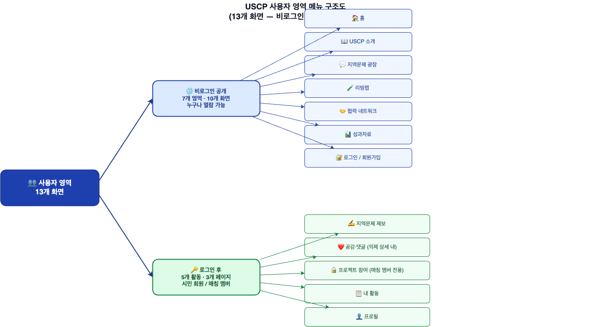
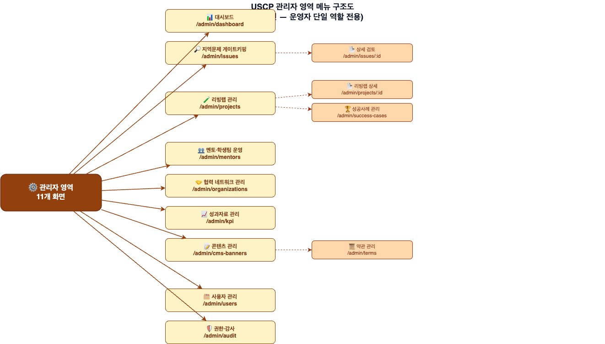

# USCP 플랫폼 메뉴 구조도

> **본 문서는 2026-05-16 견적서 기준 합의된 사업 범위 기반 메뉴 구조도입니다.**
---

## 1. 운영 원칙 (핵심 전제)

| 항목 | 결정 |
|---|---|
| 사업 범위 | 5개 지역 (대전·공주·예산·천안·세종) 통합 운영 |
| 의제 라이프사이클 | **6단계** — 제보 → 검토중 → 공개등록 → 멘토배정 → 처리중 → 해결완료 |
| 사용자 역할 | 시민 회원 / 운영자(단일 역할) / 멘토 / 학생팀 |
| 제보 모델 | 로그인 회원 제보 (회원가입 필수, 만 14세 이상) |
| 알림 채널 | 이메일 단일 (SMTP) |
| 인증 | 자체 회원가입·로그인 (SSO 없음) |
| 지도 | 카카오맵 API |

---

## 2. 사용자 구조

| 역할 | 가입 경로 | 주요 활동 |
|---|---|---|
| **시민 회원** | 이메일 회원가입 | 지역문제 제보·공감투표·댓글·내 활동 조회 |
| **운영자** | 관리자가 계정 발급 | 게이트키핑·리빙랩 등록·멘토 선정·콘텐츠·성과지표 입력 (단일 역할) |
| **멘토** | 시민 회원 가입 후 운영자가 자격 부여 | 의제별 멘토단 활동·산출물 검토 |
| **학생팀** | 시민 회원 가입 후 운영자가 팀 편성 | 의제별 리빙랩 실행·산출물 업로드 |

---

## 3. 전체 메뉴 구조 (Information Architecture)

본 플랫폼의 메뉴는 **사용자 영역**과 **관리자 영역** 2개의 큰 영역으로 구분됩니다.

| 영역 | 대상 | 화면 수 | 비고 |
|---|---|---:|---|
| **사용자 영역** | 시민·멘토·학생팀 (비로그인 + 로그인 사용자) | 13 | 공개 페이지 + 로그인 후 페이지 통합 |
| **관리자 영역** | 운영자 (단일 역할) | 11 | 지역사회특화센터 실무 담당자 전용 |
| **합계** | — | **24** | — |

---

### 3.1 사용자 영역 (시민·멘토·학생팀)

#### 3.1.1 다이어그램 — 사용자 영역 메뉴 구조

---

#### 3.1.2 비로그인 공개 페이지 (누구나 열람 가능)

> 🌐 **URL Base**: `/`

##### 🏠 홈 — `/`
- 통계 카드 (운영 지역 수·진행중 리빙랩 수·해결 완료 수)
- 6단계 프로세스 안내 바
- 최근 제보 카드
- 5개 지역 현황 지도 (카카오맵)
- 리빙랩 현황 요약 (모집중·진행중·완료)
- 협력기관 현황 요약 (지·산·학·관)
- 공지사항 바

##### 📖 USCP 소개 — `/about` *(정적 HTML)*
- 플랫폼 소개
- 5개 지역 안내
- 참여주체 안내 (지·산·학·관)
- 양교 MOU 안내 (공주대·충남대)

##### 💬 지역문제 광장 — `/issues`
- 카드형 목록 (지역·단계·**트랙 라벨** 필터, **키워드 검색** 지원)
- 단계별 진행 상태 공개
- 트랙 라벨 뱃지 표시 (정책반영·정책참고·시민자율)
- 공감수 정렬
- 📄 **제보 상세** — `/issues/:id`

##### 🧪 리빙랩 — `/projects`
- 단계별 목록 (모집중·진행중·완료)
- 📄 **리빙랩 상세** — `/projects/:id`
  - 개요·멤버·기관 정보
  - 활동 타임라인
  - 산출물 조회
  - 🔒 게시판 탭 — *멤버 전용 (멘토·학생팀·운영자만 노출)*
- 🏆 **성공사례 스토리** — `/success-cases` *(4단계: 문제→과정→결과→정책반영)*

##### 🤝 협력 네트워크 — `/network`
- 참여기관 현황 (지·산·학·관)
- MOU 현황
- 프로그램 운영 현황
- 커뮤니티 (활동소식·모임)

##### 📊 성과자료 — `/performance`
- 성과지표 현황
- 공지·이벤트 통합 게시판 *(카테고리 필터: 전체/공지/이벤트, 카드 뱃지 구분)*
- 자료실 *(가이드·양식·툴킷·기타 — 카테고리 탭, 다운로드 카운트 표시)*

##### 🔐 로그인 / 회원가입 — `/login`
- 이메일 로그인 *(실패 5회 시 30분 잠금)*
- 회원가입 *(이메일·비밀번호·이름·만 14세 이상 확인·통합 동의)*
- 비밀번호 보안 정책 *(8자 이상·영문/숫자/특수문자, JWT TTL Access 1h/Refresh 7d, 다중 디바이스 허용)*
- 약관 재동의 모달 *(로그인 시 약관 신 버전 미동의 회원에게 노출 — 동의/거부 처리)*

---

#### 3.1.3 로그인 후 사용자 페이지 (시민 회원 / 매칭 멤버)

> 👤 **URL Base**: `/user/*` · `/projects/:id`

##### ✍️ 지역문제 제보 — `/user/issue-new`
- 지역 선택 (5개 중 1개)
- 제목·내용 입력
- 사진 첨부 *(최대 5장, 각 5MB 이내, JPG/PNG/WebP)*
- 제보 등록 → 검토 단계 진입

##### ❤️ 공감투표
*의제 상세 페이지 내, 1인 1회 (취소 가능)*

##### 💬 댓글 작성·수정·삭제
*의제 상세 페이지 내, 로그인 필수, 수정·삭제는 작성자 본인 또는 운영자*

##### 🔒 프로젝트 참여 — `/projects/:id` (멤버 전용 탭)
> **접근 권한**: 매칭된 멘토·학생팀·운영자만 — 비멤버에게는 본 탭 자체 미노출

**📋 게시판** *(M03-15~18)*
- 게시글 작성·수정·삭제 *(작성자 본인 또는 운영자만 수정·삭제)*
- 게시글 목록·상세 조회 *(멤버 전용)*
- 댓글 작성·수정·삭제
- 첨부파일 업로드·다운로드 *(게시글당 1개, 20MB 이내)*

**📅 활동 타임라인 작성** *(M03-08)*
- 매칭 멤버가 자신의 프로젝트 활동을 직접 기록 (날짜·제목·내용 WYSIWYG)
- 수정·삭제는 작성자 본인 또는 운영자

**📁 산출물 업로드** *(M03-09/10)*
- 매칭 멤버가 자신의 프로젝트 산출물을 직접 업로드 (단계별 분류·태그)
- `uploaded_by` 자동 기록 → 메타데이터(제목·태그·단계) 수정은 업로드자 본인 또는 운영자

**📝 멘토단 활동 기록** *(M04-08)* — 멘토 전용
- 매칭된 **멘토 본인**이 회의·자문·검토 활동을 직접 기록
- 학생팀은 본 항목 직접 입력 불가 (위 활동 타임라인으로 대체)

> ⚠️ **운영자 전용 (멤버 권한 없음)**:
> - 리빙랩 자체 등록·수정·삭제 (M03-06/07)
> - 리빙랩 상태 변경 (M03-13)
> - 의제-리빙랩 연결 (M03-14)
> - 성공사례 스토리 작성 (M03-11/12)

##### 📋 내 활동 — `/user/my-activities`
- 내 제보 목록·진행 상황
- 내가 공감한 의제
- 내 댓글

##### 👤 프로필 — `/user/profile`
- 이름·소속·연락처 수정
- 비밀번호 변경
- 이메일 알림 수신 설정
- 회원 탈퇴

---

### 3.2 관리자 영역 (운영자 단일 역할)

#### 3.2.1 다이어그램 — 관리자 영역 메뉴 구조

---

#### 3.2.2 관리자 영역 메뉴 상세

> ⚙️ **URL Base**: `/admin/*`

##### 📊 대시보드 — `/admin/dashboard`
- 전체 현황 수치
- 처리 대기 제보 (게이트키핑 큐)
- 시각화 차트 (지역별·단계별)

##### 🔎 지역문제 게이트키핑 — `/admin/issues`
- 신규 제보 검토 큐 *(키워드 검색·필터)*
- 📄 **상세 검토** — `/admin/issues/:id`
- 승인 → 단계 전환 *(자동 이메일 알림)*
- 검토중 진입 시 **트랙 라벨 지정** (정책반영·정책참고·시민자율)
- 반려 → 사유 기록 *(감사 로그)*
- 검토 의견 입력
- 댓글로 해결 → 단계 전환 *(resolved, 사유=comment_resolution)*
- 6단계 진행 이력 자동 기록

##### 🧪 리빙랩 관리 — `/admin/projects`
- 리빙랩 등록·수정 *(5개 지역 분류·6단계 연동)*
- 📄 **상세** — `/admin/projects/:id`
- 활동 타임라인 작성
- 산출물 업로드 *(단계별 분류)*
- 게시판 관리 — *게시글·댓글 조정 권한 (멤버 전용 비공개 게시판)*
- 🏆 **성공사례 스토리 작성** — `/admin/success-cases` *(4단계)*

##### 👥 멘토·학생팀 운영 — `/admin/mentors`
- 멘토 선정 *(가입자 중 운영자가 자격 부여)*
- 학생팀 구성 *(가입자 중 운영자가 직접 편성)*
- 멘토단 매칭 *(운영자 수동 매칭)*
- 매칭 알림 발송 *(이메일 통보형)*
- 멘토단 활동 기록

##### 🤝 협력 네트워크 관리 — `/admin/organizations`
- 협력기관 등록·수정·삭제·활성 토글 *(지·산·학·관, FK 무결성 검증)*
- MOU 등록·생애주기 관리
- 프로그램 통합 운영
- 커뮤니티 게시글·댓글 관리

##### 📈 성과자료 관리 — `/admin/kpi`
- 성과지표 등록·수정
- 실적 입력 *(월별·분기별)*
- 자동 집계 *(해결완료 카운트)*
- 엑셀/CSV 다운로드
- 성과지표 대시보드

##### 📝 콘텐츠 관리 — `/admin/cms-banners`
- 공지사항 *(WYSIWYG 에디터)* — 공지·이벤트 통합 게시판에 "공지" 뱃지로 노출
- 이벤트 공지 *(WYSIWYG 에디터)* — 공지·이벤트 통합 게시판에 "이벤트" 뱃지로 노출
- 자료실 파일 업로드 *(카테고리: 가이드/양식/툴킷/기타, 다운로드 카운트 조회)*
- 메인 배너 관리 *(단순 도구)*
- 📜 **약관 관리** — `/admin/terms` — WYSIWYG + 버전 관리 + **새 버전 발행 시 재동의 필요 토글**

##### 🗂 사용자 관리 — `/admin/users`
- 시민 회원 목록·검색
- 운영자 추가·삭제
- 멘토 자격 부여

##### 🛡 권한·감사 — `/admin/audit`
- 로그인 이력
- 게이트키핑 이력 *(누가·언제·승인/반려)*
- 개인정보 조회 로그
- 시스템 활동 로그
- 보관 정책: 최소 1년

## 4. 화면 목록 (총 24개)

### 4.1 사용자 영역 (13개)

| # | 화면명 | 경로 | 접근 | 비고 |
|---|---|---|---|---|
| 1 | 홈 | `/` | 누구나 | 통계·지도·요약 위젯 |
| 2 | USCP 소개 | `/about` | 누구나 | 정적 HTML, 5개 지역·MOU 안내 |
| 3 | 지역문제 광장 (목록) | `/issues` | 누구나 | 필터(지역·단계·트랙)·키워드 검색·정렬·트랙 뱃지 |
| 4 | 지역문제 상세 | `/issues/:id` | 누구나 | 공감·댓글·트랙 뱃지 |
| 5 | 리빙랩 목록 | `/projects` | 누구나 | 단계 필터 |
| 6 | 리빙랩 상세 | `/projects/:id` | 누구나 (게시판 탭은 멤버 전용) | 타임라인·산출물·게시판 탭 |
| 7 | 성공사례 | `/success-cases` | 누구나 | 4단계 스토리 |
| 8 | 협력 네트워크 | `/network` | 누구나 | 기관·MOU·커뮤니티 |
| 9 | 성과자료 | `/performance` | 누구나 | 지표·자료실·공지·이벤트 통합 게시판(카테고리 필터) |
| 10 | 로그인/회원가입 | `/login` | 누구나 | 통합 동의·14세 확인·약관 재동의 모달 |
| 11 | 제보 작성 | `/user/issue-new` | 시민 회원 | 지역·사진 첨부 |
| 12 | 내 활동 | `/user/my-activities` | 시민 회원 | 내 제보·공감·댓글 |
| 13 | 프로필 | `/user/profile` | 시민 회원 | 정보 수정·탈퇴 |

### 4.2 관리자 영역 (11개)

| # | 화면명 | 경로 | 견적서 모듈 |
|---|---|---|---|
| 14 | 대시보드 | `/admin/dashboard` | 공통 컴포넌트 |
| 15 | 게이트키핑 목록 | `/admin/issues` | 제보·게이트키핑 (트랙 라벨 컬럼) |
| 16 | 게이트키핑 상세 | `/admin/issues/:id` | 제보·게이트키핑 (트랙 라벨 지정 UI) |
| 17 | 리빙랩 관리 | `/admin/projects` (+`/:id`, 게시판 관리 탭 포함) | 리빙랩 운영 |
| 18 | 성공사례 관리 | `/admin/success-cases` | 리빙랩 운영 |
| 19 | 멘토·학생팀 운영 | `/admin/mentors` | 멘토·학생팀 매칭 |
| 20 | 협력기관 관리 | `/admin/organizations` | 협력 네트워크 |
| 21 | 성과지표 관리 | `/admin/kpi` | 성과자료 |
| 22 | 콘텐츠 관리(배너) | `/admin/cms-banners` | 콘텐츠 관리 |
| 23 | 약관 관리 | `/admin/terms` | 콘텐츠 관리 (버전 발행 시 재동의 필요 토글) |
| 24 | 사용자·감사 | `/admin/users`, `/admin/audit` | 권한·감사 |
