

# USCP 플랫폼 기능 상세 명세서

> **본 문서는 2026-05-16 제공해드린 견적서를 기반으로 작성한 전체 기능에 대한 기능 상세 명세서입니다.**

---

## 0. 문서 안내

### 0.1 명세 형식

각 기능은 다음 4개 항목으로 정리되어 있습니다.

| 항목 | 내용 |
|---|---|
| **목적** | 이 기능이 사용자(시민·운영자·멘토·학생)에게 무엇을 해주는지 |
| **입력** | 사용자가 화면에서 어떤 정보를 입력하거나 선택하는지 |
| **권한** | 이 기능을 누가 사용할 수 있는지 (시민 회원·운영자·매칭 멤버 등) |
| **유의사항** | 이 기능을 사용할 때 차단되는 경우, 자동으로 처리되는 안내 사항 |

### 0.2 권한 용어 풀이

| 용어 | 풀이 |
|---|---|
| 누구나 (비로그인 포함) | 로그인하지 않은 일반 방문자도 사용 가능 |
| 시민 회원 | 이메일로 회원가입을 마치고 이메일 인증까지 완료한 일반 가입자 |
| 멘토 · 학생팀 | 시민 회원 중에서 운영자가 "멘토" 또는 "학생팀 구성원" 자격을 부여한 사람 |
| 매칭 멤버 | 특정 리빙랩 프로젝트에 배정된 멘토·학생팀과 그 프로젝트를 담당하는 운영자 |
| 운영자 | 지역사회특화센터 실무 담당자 — 모든 관리 기능에 접근할 수 있는 단일 관리자 역할 |
| 작성자 본인 | 게시글·댓글·산출물 등을 직접 등록한 사람 (수정·삭제 권한이 본인에게만 주어짐) |
| 시스템 자동 | 사람이 직접 실행하지 않고, 특정 조건이 충족되면 시스템이 알아서 처리하는 기능 |

---

## M01. 회원·인증 모듈 (13개)

### 📷 M01 관련 화면

| # | 화면 |
|---|---|
| #10 | 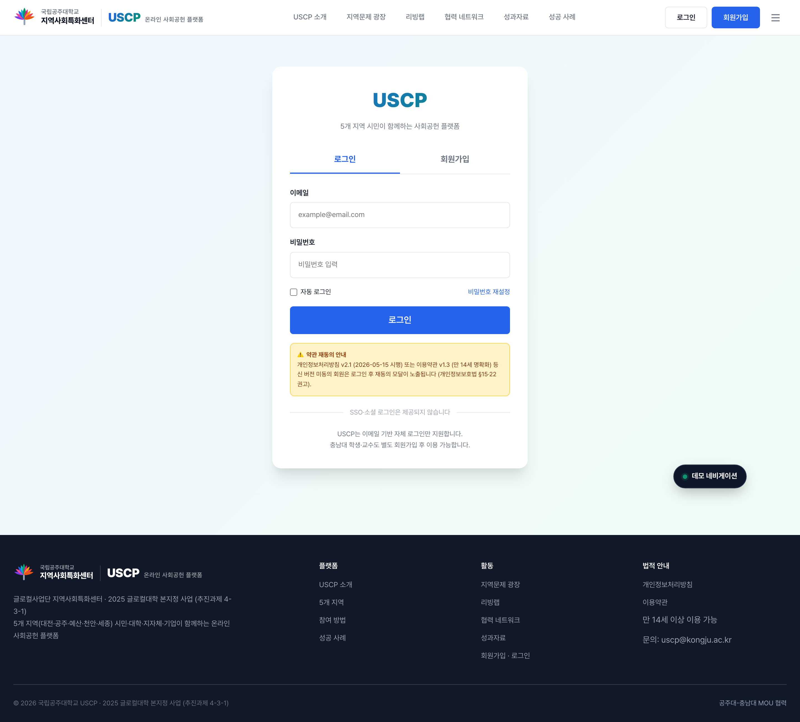 |
| #13 | 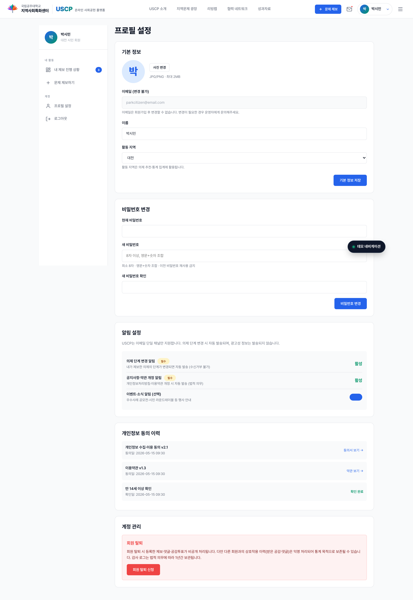 |

### M01-01: 이메일 회원가입
- **목적**: 일반 시민이 USCP 플랫폼의 회원이 되어 지역문제 제보·공감·댓글 등을 이용할 수 있도록 계정을 만드는 기능입니다.
- **입력**: 이메일 주소(인증 메일을 받을 주소), 비밀번호(보안 정책에 맞춘 안전한 비밀번호), 이름(2~20자), 출생연도(만 14세 이상인지 확인용), 이용약관·개인정보 처리방침 동의 체크박스를 입력합니다.
- **권한**: 누구나 (비로그인 포함) 회원가입 화면에 접근하여 신청할 수 있습니다.
- **유의사항**: 만 14세 미만은 가입할 수 없으며, 약관에 동의하지 않으면 가입이 진행되지 않습니다. 가입 신청 후 24시간 이내에 이메일로 발송되는 인증 링크를 클릭하지 않으면 정식 회원이 되지 않아 로그인이 제한됩니다.

### M01-02: 만 14세 이상 확인
- **목적**: 개인정보보호법에 따라 만 14세 미만의 가입을 자동으로 차단하기 위한 확인 절차입니다.
- **입력**: 회원가입 화면에서 출생연도(예: 2008)를 입력하면 시스템이 자동으로 만 나이를 계산합니다.
- **권한**: 누구나 (비로그인 포함) 회원가입 시 자동으로 적용됩니다.
- **유의사항**: 만 14세 미만으로 확인되면 즉시 "만 14세 이상부터 이용 가능합니다"라는 안내와 함께 가입 절차가 중단됩니다. 법정대리인 동의를 통한 우회 가입 절차는 본 사업 범위에서 제공하지 않습니다.

### M01-03: 개인정보·이용약관 통합 동의
- **목적**: 회원가입에 필요한 두 가지 필수 동의(이용약관, 개인정보 수집·이용)를 한 번의 절차로 받기 위한 기능입니다.
- **입력**: 이용약관 동의 체크박스(필수)와 개인정보 수집·이용 동의 체크박스(필수) 두 가지를 사용자가 직접 체크합니다.
- **권한**: 누구나 (비로그인 포함) 회원가입 절차에서 표시됩니다.
- **유의사항**: 두 항목 중 하나라도 동의하지 않으면 회원가입이 진행되지 않습니다. 광고성 정보 수신 동의는 별도로 제공하지 않으며, 마케팅 메일은 전혀 발송되지 않습니다.

### M01-04: 이메일 로그인
- **목적**: 이미 가입한 회원이 본인 계정으로 로그인하여 제보·공감·댓글 등의 서비스를 이용하기 위한 기능입니다.
- **입력**: 회원가입 시 등록한 이메일 주소와 비밀번호를 입력합니다.
- **권한**: 누구나 (비로그인 포함) 로그인 화면에서 시도할 수 있습니다.
- **유의사항**: 비밀번호를 5회 연속 잘못 입력하면 30분간 해당 계정의 로그인이 자동으로 잠깁니다. 이메일 인증을 아직 완료하지 않은 계정이나 운영자가 정지시킨 계정은 로그인이 제한됩니다. 로그인 성공 후에는 일정 시간 자동 로그인이 유지되며, 7일이 지나면 다시 로그인해야 합니다.

### M01-05: 로그아웃
- **목적**: 회원이 사용 중인 기기에서 로그인 상태를 안전하게 종료하기 위한 기능입니다.
- **입력**: 화면 상단의 "로그아웃" 버튼을 클릭하면 즉시 처리됩니다.
- **권한**: 시민 회원 이상의 로그인된 사용자
- **유의사항**: 이미 로그아웃된 상태에서 다시 로그아웃을 시도해도 오류 없이 정상 처리됩니다. 로그아웃 후에는 같은 기기에서 자동 로그인이 더 이상 유지되지 않습니다.

### M01-06: 비밀번호 변경
- **목적**: 로그인한 회원이 자신의 비밀번호를 더 안전한 것으로 바꾸기 위한 기능입니다.
- **입력**: 현재 사용 중인 비밀번호(본인 확인용), 새로 사용할 비밀번호, 새 비밀번호 확인 입력란을 작성합니다.
- **권한**: 시민 회원 이상의 로그인된 사용자가 본인 계정에 한해 변경할 수 있습니다.
- **유의사항**: 현재 비밀번호가 일치하지 않으면 변경이 거부됩니다. 새 비밀번호가 기존 비밀번호와 동일하면 변경이 허용되지 않습니다. 비밀번호 변경 후에는 보안을 위해 모든 기기에서 자동 로그아웃되어 다시 로그인해야 합니다.

### M01-07: 비밀번호 재설정
- **목적**: 비밀번호를 잊어버린 회원이 이메일을 통해 본인 확인 후 새 비밀번호를 설정할 수 있도록 돕는 기능입니다.
- **입력**: 1단계에서는 가입한 이메일 주소를 입력하면 재설정 안내 메일이 발송됩니다. 2단계에서는 메일에 포함된 링크를 클릭한 뒤 새 비밀번호를 입력합니다.
- **권한**: 누구나 (비로그인 포함) 로그인 화면의 "비밀번호 찾기"를 통해 이용할 수 있습니다.
- **유의사항**: 재설정 링크는 발급 후 1시간 동안만 유효하며, 한 번 사용하면 다시 사용할 수 없습니다. 보안을 위해 가입되지 않은 이메일을 입력해도 "메일을 발송했습니다"라는 동일한 안내가 표시되어, 가입 여부를 외부에 노출하지 않습니다.

### M01-08: 프로필 조회·수정
- **목적**: 회원이 자신의 기본 정보(이름·소속·연락처)를 확인하고 변경할 수 있도록 합니다.
- **입력**: 마이페이지에서 수정하고자 하는 항목(이름·소속·연락처)을 자유롭게 입력합니다.
- **권한**: 시민 회원 이상의 로그인된 사용자가 본인 정보에 한해 조회·수정할 수 있습니다.
- **유의사항**: 이메일 주소는 본 화면에서 변경할 수 없습니다(추가 본인 인증 절차가 필요하여 본 사업 범위 외). 입력 형식이 맞지 않으면 저장이 거부되며 안내 메시지가 표시됩니다.

### M01-09: 이메일 알림 수신 설정
- **목적**: 본인이 제보한 의제의 진행 단계가 변경될 때 이메일 알림을 받을지 여부를 회원이 직접 선택할 수 있도록 하는 기능입니다.
- **입력**: 마이페이지의 알림 설정 화면에서 "단계 변경 알림 받기" 토글 스위치를 켜거나 끕니다.
- **권한**: 시민 회원 이상의 로그인된 사용자가 본인 설정만 변경할 수 있습니다.
- **유의사항**: 본 설정은 의제 진행 안내 메일에만 적용됩니다. 비밀번호 재설정·약관 개정 안내처럼 법적으로 의무 발송되는 이메일은 본 설정과 무관하게 발송됩니다.

### M01-10: 회원 탈퇴
- **목적**: 회원이 더 이상 USCP를 이용하지 않을 때 본인 계정을 영구적으로 삭제할 수 있도록 하는 기능입니다.
- **입력**: 본인 확인을 위해 현재 비밀번호를 다시 입력하고, 탈퇴 사유(선택 사항)를 작성합니다.
- **권한**: 시민 회원 이상의 로그인된 사용자가 본인 계정에 한해 탈퇴할 수 있습니다.
- **유의사항**: 탈퇴 즉시 이름은 "****"로 가려지고 이메일은 익명화되며, 90일이 지나면 시스템에서 완전히 삭제됩니다. 탈퇴 후 본인이 작성한 제보·게시글·댓글은 익명 표시로 남습니다. 운영자 계정은 본 기능으로 탈퇴할 수 없으며, 다른 운영자가 별도로 비활성화 처리해야 합니다.

### M01-11: 이용약관 페이지
- **목적**: 현재 시행 중인 이용약관 전문을 누구나 언제든 확인할 수 있도록 공개하는 기능입니다.
- **입력**: 페이지 하단의 푸터 링크를 클릭하면 별도 입력 없이 약관 전문이 표시됩니다.
- **권한**: 누구나 (비로그인 포함) 열람할 수 있습니다.
- **유의사항**: 약관이 아직 작성되지 않은 초기 상태에서는 기본 안내 페이지가 대신 표시됩니다. 약관에는 현재 버전 번호와 시행일이 함께 안내됩니다.

### M01-12: 개인정보처리방침 페이지
- **목적**: 회원의 개인정보를 어떤 목적으로 수집·이용·보관·파기하는지 명시한 개인정보처리방침 전문을 공개하는 기능입니다.
- **입력**: 푸터 링크 클릭으로 접근하며 별도 입력은 필요 없습니다.
- **권한**: 누구나 (비로그인 포함) 열람할 수 있습니다.
- **유의사항**: 본 페이지 상단에는 "개인정보 처리자: 국립공주대학교 글로컬사업단 지역사회특화센터"가 명시되어, 데이터 책임 주체가 명확히 안내됩니다. 약관과 마찬가지로 버전과 시행일이 함께 표시됩니다.

### M01-13: 비밀번호 보안 정책 (통합)
- **목적**: 회원 계정을 안전하게 보호하기 위한 4가지 보안 규칙(비밀번호 복잡도·잠금·자동 로그인 유지·다중 기기 허용)을 시스템 전체에 일관되게 적용하는 정책입니다.
- **입력**: 별도 사용자 입력 없이 시스템이 자동으로 적용합니다.
- **권한**: 시스템 자동 — 모든 회원에게 동일하게 적용됩니다.
- **유의사항**:
  - **비밀번호 복잡도**: 회원가입·비밀번호 변경·재설정 시 8자 이상이면서 영문·숫자·특수문자가 모두 포함된 경우에만 허용됩니다.
  - **로그인 실패 잠금**: 비밀번호를 5회 연속 잘못 입력하면 해당 계정이 30분간 자동 잠금되며, 잠금 중에는 남은 시간이 화면에 표시됩니다.
  - **자동 로그인 유지**: 로그인 후 7일 동안 자동 로그인이 유지되며, 1시간마다 시스템이 인증 정보를 자동 갱신합니다.
  - **다중 기기 허용**: 한 회원이 PC·휴대폰 등 여러 기기에서 동시에 로그인할 수 있습니다(별도 제한 없음).

---

## M02. 지역문제 제보·게이트키핑 모듈 (21개)

### 📷 M02 관련 화면

| # | 화면 |
|---|---|
| #3 | 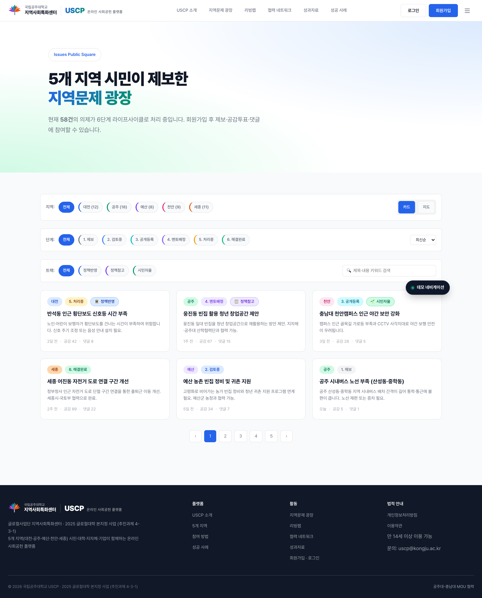 |
| #4 | 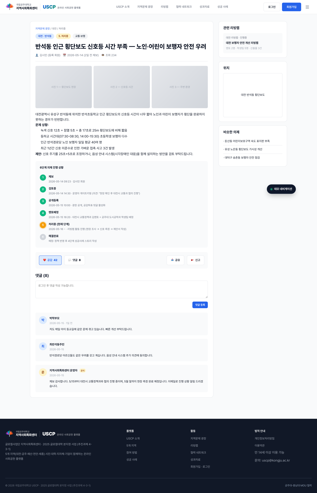 |
| #11 | 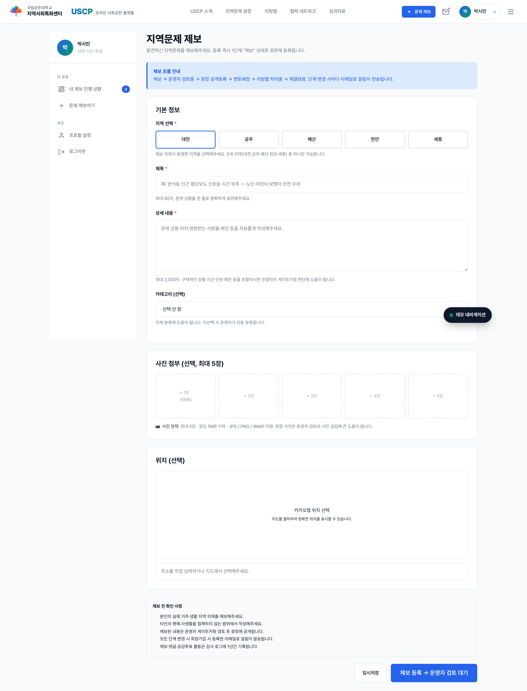 |
| #15 | 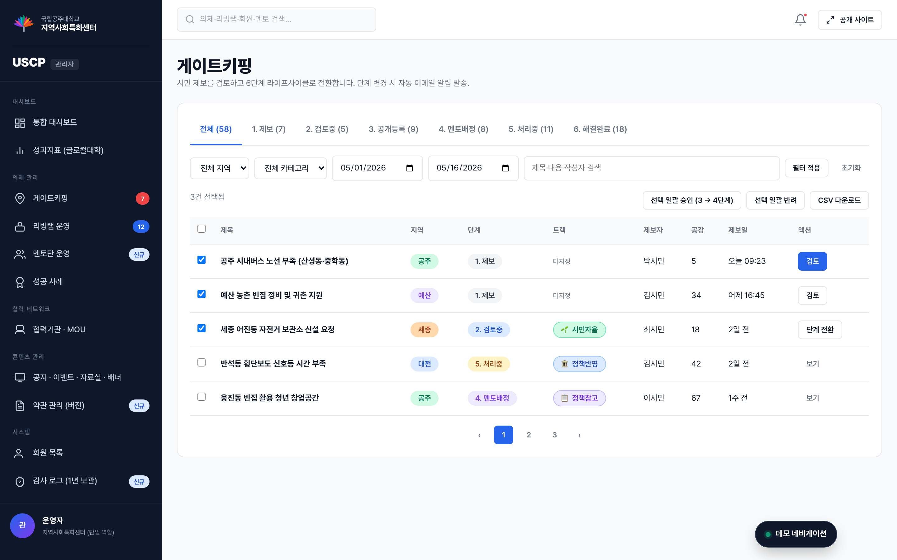 |
| #16 | 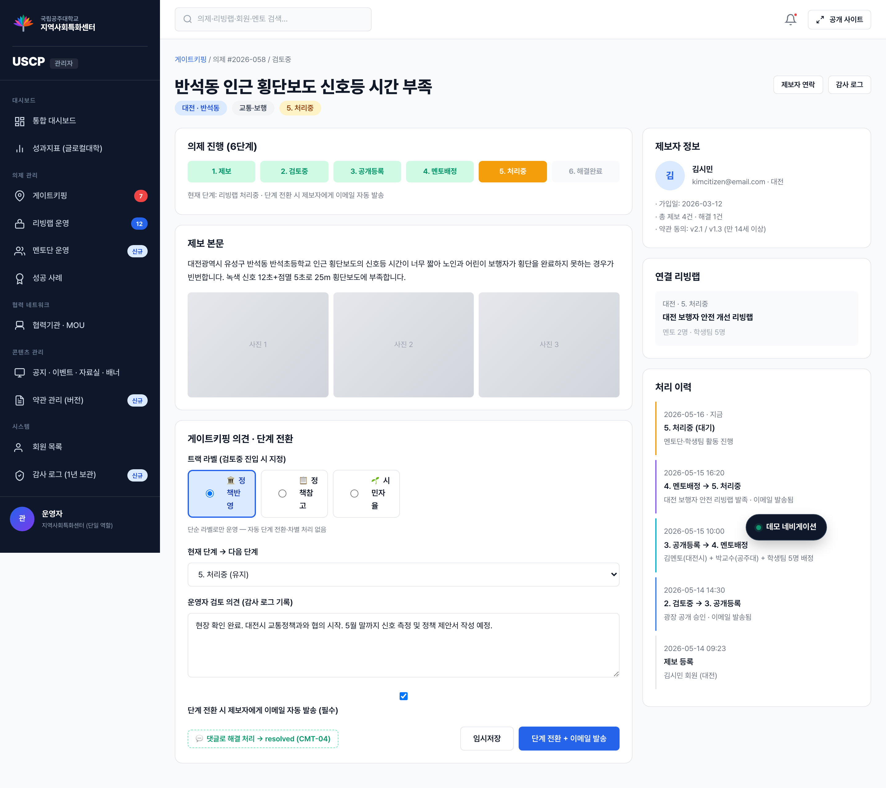 |

### M02-01: 지역문제 제보 등록
- **목적**: 시민 회원이 본인이 사는 지역에서 발견한 사회 문제·불편사항을 USCP에 제보하여 운영자 검토를 받을 수 있도록 합니다.
- **입력**: 5개 지역(대전·공주·예산·천안·세종) 중 하나를 선택하고, 제보 제목(1~100자), 본문(10~5,000자), 사진(선택 사항, 최대 5장)을 입력합니다.
- **권한**: 시민 회원 이상의 로그인된 사용자만 제보할 수 있습니다.
- **유의사항**: 사진은 1장당 5MB 이내, JPG·PNG·WebP 형식만 허용됩니다. 같은 사용자가 같은 지역에 5분 이내 3건을 연속 제보하면 스팸 방지를 위해 일시 차단됩니다. 제보가 완료되면 자동으로 "제보 완료" 단계로 시작되며, 운영자 검토 대기 상태가 됩니다.

### M02-02: 제보 목록 (카드형)
- **목적**: 로그인 여부와 관계없이 누구나 USCP에 등록된 전체 제보를 카드 형태로 한눈에 둘러볼 수 있도록 합니다.
- **입력**: 화면 상단의 필터(지역·진행 단계·트랙 라벨)와 정렬 옵션(최신순·공감순)을 선택하거나, 검색창에 키워드를 입력할 수 있습니다.
- **권한**: 누구나 (비로그인 포함) 자유롭게 열람할 수 있습니다.
- **유의사항**: 잘못된 필터 값을 입력해도 오류 메시지 대신 자동으로 안전한 기본값(전체)이 적용되어 항상 결과가 표시됩니다. 한 페이지에 20건씩 표시되며, 스크롤을 내리면 다음 결과가 자동으로 더 불러와집니다.

### M02-03: 제보 상세 페이지
- **목적**: 특정 제보 1건의 전체 내용·현재 진행 단계·공감 수·댓글을 자세히 확인할 수 있도록 합니다.
- **입력**: 카드 목록에서 원하는 제보를 클릭하면 상세 페이지로 이동합니다.
- **권한**: 누구나 (비로그인 포함) 열람할 수 있습니다(단, 운영자가 반려한 제보는 비공개).
- **유의사항**: 운영자가 부적합으로 반려한 제보는 일반 사용자에게 표시되지 않으며, 운영자만 확인할 수 있습니다. 현재 어느 단계(제보→검토중→공개등록→멘토배정→처리중→해결완료)에 있는지 진행 막대로 직관적으로 표시됩니다.

### M02-04: 공감 투표
- **목적**: 시민 회원이 다른 사람의 제보에 공감을 표시하여, 더 많은 시민이 동의하는 의제가 우선 처리될 수 있도록 합니다.
- **입력**: 제보 상세 페이지의 "공감하기" 하트 버튼을 클릭합니다(다시 누르면 공감 취소).
- **권한**: 시민 회원 이상의 로그인된 사용자만 공감할 수 있으며, 한 사람당 한 제보에 1회로 제한됩니다.
- **유의사항**: 본인이 등록한 제보에도 공감할 수 있습니다(별도 제한 없음). 이미 공감한 제보에 다시 공감을 시도하면 자동으로 공감 취소 처리됩니다.

### M02-05: 댓글 작성·수정·삭제
- **목적**: 제보에 대해 시민이 의견을 나누거나 추가 정보를 공유할 수 있도록 댓글 기능을 제공합니다.
- **입력**: 제보 상세 페이지 하단의 댓글 입력란에 본문(1~1,000자)을 작성한 뒤 등록합니다. 본인이 작성한 댓글은 수정·삭제할 수 있습니다.
- **권한**: 시민 회원 이상의 로그인된 사용자가 댓글을 작성할 수 있습니다. 수정·삭제는 본인 댓글에 한하며, 운영자는 부적절한 댓글을 조정 차원에서 삭제할 수 있습니다.
- **유의사항**: 운영자가 반려한 제보에는 새 댓글을 작성할 수 없습니다. 운영자가 댓글을 삭제한 경우에도 "삭제된 댓글입니다"라는 흔적은 남아 이력이 보존됩니다.

### M02-06: 내 제보 진행 상황 조회
- **목적**: 본인이 등록한 제보들이 현재 어느 단계까지 진행되었는지 한 화면에서 확인할 수 있도록 합니다.
- **입력**: 마이페이지의 "내 활동" 탭으로 이동하면 자동으로 본인 제보 목록이 표시됩니다.
- **권한**: 시민 회원 이상의 로그인된 사용자가 본인이 작성한 제보만 조회할 수 있습니다.
- **유의사항**: 탈퇴한 회원의 제보는 익명 처리되며, 본인 마이페이지에서는 더 이상 조회할 수 없습니다. 단계별로 그룹화되어 보이며, 최근 단계 변경 일시도 함께 표시됩니다.

### M02-07: 게이트키핑 대기 목록 (운영자)
- **목적**: 운영자가 검토해야 할 신규·진행 중 제보를 한 화면에 모아 효율적으로 처리할 수 있도록 합니다.
- **입력**: 운영자 화면에서 단계·지역·키워드 필터를 선택하거나, 정렬 옵션(최신순·공감순)을 변경합니다.
- **권한**: 운영자만 접근할 수 있습니다.
- **유의사항**: 검토되지 않은 제보가 우선 표시되며, 단계별 건수가 상단에 카운트로 표시되어 처리 현황을 한눈에 파악할 수 있습니다.

### M02-08: 제보 검토 화면 (운영자)
- **목적**: 운영자가 개별 제보의 상세 내용을 확인하고 검토 의견을 작성하여 다음 단계로 진행시킬 수 있도록 합니다.
- **입력**: 제보 본문·사진·공감·댓글·이력을 모두 확인한 뒤, 검토 의견을 텍스트로 입력하고 다음 단계 진입 시 트랙 라벨을 지정합니다.
- **권한**: 운영자만 접근할 수 있습니다.
- **유의사항**: 동시에 다른 운영자가 같은 제보를 편집 중일 경우 화면에 경고 알림이 표시되어 충돌을 방지합니다.

### M02-09: 1단계 — 제보 → 검토중 전환
- **목적**: 새로 들어온 제보를 운영자가 검토 중인 상태로 진입시킵니다(6단계 라이프사이클의 1번째 단계 전환).
- **입력**: 제보 ID, 검토 의견, 트랙 라벨(정책반영·정책참고·시민자율 중 하나) 필수 선택.
- **권한**: 운영자만 단계 전환을 실행할 수 있습니다.
- **유의사항**: 트랙 라벨을 지정하지 않으면 검토중 단계로 전환되지 않습니다. 단계 전환과 동시에 제보자에게 이메일 안내가 자동 발송됩니다.

### M02-10: 2단계 — 검토중 → 공개등록 전환
- **목적**: 검토를 마친 제보를 광장(/issues)에 공식 공개하여 시민이 공감·댓글로 참여할 수 있도록 합니다.
- **입력**: 제보 ID, 운영자 검토 의견(감사 로그용).
- **권한**: 운영자만 단계 전환을 실행할 수 있습니다.
- **유의사항**: 트랙 라벨은 1단계에서 이미 지정되어 있어야 합니다. 단계 전환과 동시에 제보자에게 "광장에 공개되었습니다" 안내가 이메일로 발송됩니다.

### M02-11: 3단계 — 공개등록 → 멘토배정 전환
- **목적**: 공개된 의제 중 멘토·학생팀이 참여하여 해결할 가치가 있는 의제로 진행시킵니다.
- **입력**: 제보 ID, 검토 의견. 멘토·학생팀 매칭 정보는 별도 화면(M04)에서 입력합니다.
- **권한**: 운영자만 단계 전환을 실행할 수 있습니다.
- **유의사항**: 멘토·학생팀이 아직 배정되지 않아도 단계 전환은 가능하나, 매칭 데이터가 없을 경우 안내 메시지가 표시됩니다.

### M02-12: 4단계 — 멘토배정 → 처리중 전환
- **목적**: 멘토·학생팀이 의제 해결을 위한 리빙랩 활동을 본격적으로 시작하는 단계로 진입시킵니다.
- **입력**: 제보 ID, 검토 의견. 연결할 리빙랩 프로젝트 ID(선택 사항).
- **권한**: 운영자만 단계 전환을 실행할 수 있습니다.
- **유의사항**: 멘토단이 아직 배정되지 않은 상태에서도 운영자 책임 하에 강제 진입이 가능합니다. 연결된 리빙랩 프로젝트가 있으면 해당 프로젝트도 "진행중" 상태로 자동 동기화됩니다.

### M02-13: 5단계 — 처리중 → 해결완료 전환
- **목적**: 의제가 완전히 해결되어 종결되는 마지막 단계로 진입시키고, 글로컬대학 성과지표에 "해결 완료" 1건이 자동 집계됩니다.
- **입력**: 제보 ID, 검토 의견. 산출물 등록 후 진행하는 것이 권장됩니다.
- **권한**: 운영자만 단계 전환을 실행할 수 있습니다.
- **유의사항**: 산출물이 1건도 등록되지 않은 상태에서 종결을 시도하면 경고 알림이 표시됩니다(강제 진행 가능). 종결과 동시에 성과지표 카운트가 1 증가하고, 제보자·매칭 멘토단에게 완료 안내 이메일이 발송됩니다.

### M02-14: 반려 처리
- **목적**: 부적합하거나 중복인 제보를 운영자가 반려 처리하고, 사유를 기록하여 향후 감사·재검토에 활용할 수 있도록 합니다.
- **입력**: 제보 ID, 반려 사유(필수, 30자 이상으로 구체적으로 작성).
- **권한**: 운영자만 반려 처리를 실행할 수 있습니다.
- **유의사항**: 사유가 30자 미만이거나 누락된 경우 반려가 거부됩니다. 반려된 제보는 일반 사용자에게 더 이상 표시되지 않으며, 제보자에게는 반려 사유와 함께 이메일이 자동 발송됩니다.

### M02-15: 6단계 진행 이력 자동 기록
- **목적**: 모든 단계 전환 시점·작업자·이전 단계·다음 단계를 시스템이 자동으로 기록하여, 감사·문의 시 명확한 추적이 가능하도록 합니다.
- **입력**: 별도 사용자 입력 없음 — 단계 전환이 발생할 때마다 시스템이 자동으로 기록합니다.
- **권한**: 시스템 자동 — 직접 호출할 수 없습니다.
- **유의사항**: 여러 운영자가 동시에 단계 전환을 시도해도 데이터 충돌 없이 한 번에 하나씩만 안전하게 기록됩니다.

### M02-16: 단계 변경 시 이메일 알림 발송
- **목적**: 의제 단계가 변경될 때마다 관련 사용자(제보자·운영자·매칭 멘토단)에게 자동으로 이메일을 발송하여 진행 상황을 공유합니다.
- **입력**: 별도 사용자 입력 없음 — 단계 전환과 동시에 시스템이 자동으로 발송합니다.
- **권한**: 시스템 자동
- **유의사항**: 마이페이지에서 알림 수신을 끈 회원에게는 발송되지 않습니다(단, 계정 보안·약관 개정 같은 의무 발송 메일은 설정과 무관하게 발송). 발송이 실패하면 시스템이 일정 간격으로 최대 5회까지 자동 재시도합니다.

### M02-17: 게이트키핑 이력 조회
- **목적**: 특정 제보가 어떤 운영자에 의해 언제 어떻게 단계가 전환되었는지 시간 순으로 확인할 수 있도록 합니다.
- **입력**: 제보 ID로 자동 조회됩니다.
- **권한**: 운영자만 조회할 수 있습니다.
- **유의사항**: 본 이력은 감사 로그 화면에서도 통합 조회할 수 있습니다.

### M02-18: 처리 통계 (단계별·지역별)
- **목적**: 운영자가 단계별·지역별·트랙별로 의제 처리 건수와 추이를 한눈에 파악할 수 있도록 통계를 제공합니다.
- **입력**: 조회 기간(월별·분기별·연도별), 묶음 기준(단계·지역·트랙).
- **권한**: 운영자만 조회할 수 있습니다.
- **유의사항**: 응답 속도 향상을 위해 1분 동안 같은 결과가 캐시되어 즉시 표시됩니다.

### M02-19: 의제 트랙 라벨 (3종 — 정책반영·정책참고·시민자율)
- **목적**: 의제를 성격에 따라 3가지 트랙(정책에 반영 추진·정책 참고용·시민 자율 활동)으로 분류하여 광장에서 한눈에 구분할 수 있도록 합니다.
- **입력**: 운영자가 검토중 단계로 전환할 때 3가지 트랙 중 하나를 선택합니다.
- **권한**: 트랙 지정은 운영자만 가능하며, 라벨 조회·필터는 누구나 (비로그인 포함) 이용할 수 있습니다.
- **유의사항**: 트랙 라벨은 단순 분류 표시일 뿐이며, 라벨에 따라 자동 단계 전환이 일어나거나 차별적 처리가 적용되지는 않습니다(1차 미팅에서 합의). 광장 카드와 상세 페이지에 색상 배지로 표시됩니다.

### M02-20: 제보 키워드 검색
- **목적**: 사용자가 광장에서 특정 키워드(예: "횡단보도", "빈집")가 포함된 제보를 빠르게 찾을 수 있도록 합니다.
- **입력**: 검색창에 2~50자 길이의 키워드를 입력합니다.
- **권한**: 광장 검색은 누구나 (비로그인 포함), 게이트키핑 큐 검색은 운영자만 이용할 수 있습니다.
- **유의사항**: 검색어가 1자 이하인 경우 검색이 적용되지 않고 전체 결과가 표시됩니다. 제목과 본문 모두에서 검색하며, 단어 일부가 포함되어도 검색됩니다(예: "횡단" 검색 시 "횡단보도"도 결과에 포함).

### M02-21: 댓글로 해결된 제보 종결 처리
- **목적**: 단순한 문의·정보 부족 같은 의제가 운영자의 댓글 답변만으로 해결된 경우, 6단계 정상 절차를 거치지 않고 곧바로 "해결 완료"로 종결할 수 있도록 하는 간소화 기능입니다.
- **입력**: 제보 ID, 해결로 인정할 댓글 ID를 선택합니다.
- **권한**: 운영자만 본 종결 처리를 실행할 수 있습니다.
- **유의사항**: 본 기능은 6단계 정상 워크플로우(M02-09~13)를 우회하는 별도 경로이며, 운영자의 책임 하에 신중히 사용해야 합니다. 종결 사유는 "댓글 답변으로 해결"로 자동 기록되며, 제보자에게 안내 메일이 발송됩니다.

---

## M03. 리빙랩 운영 모듈 (18개)

### 📷 M03 관련 화면

| # | 화면 |
|---|---|
| #5 | 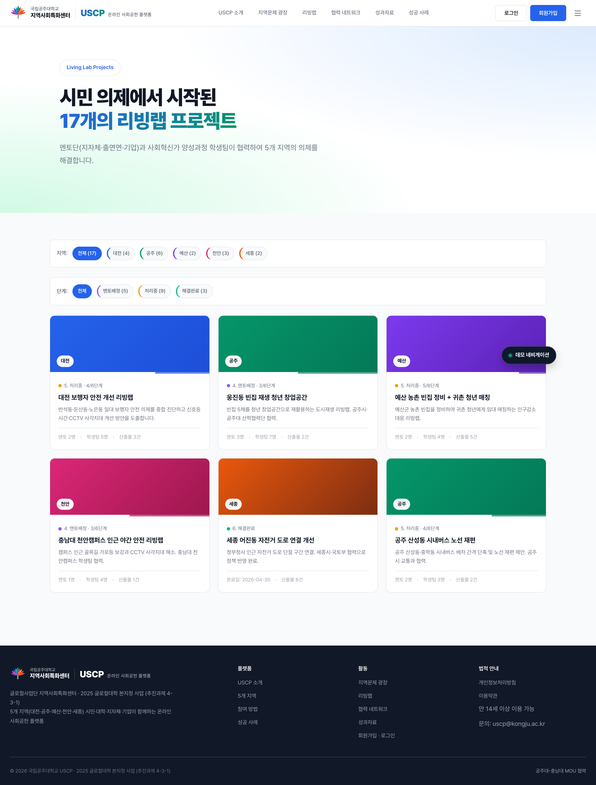 |
| #6 | 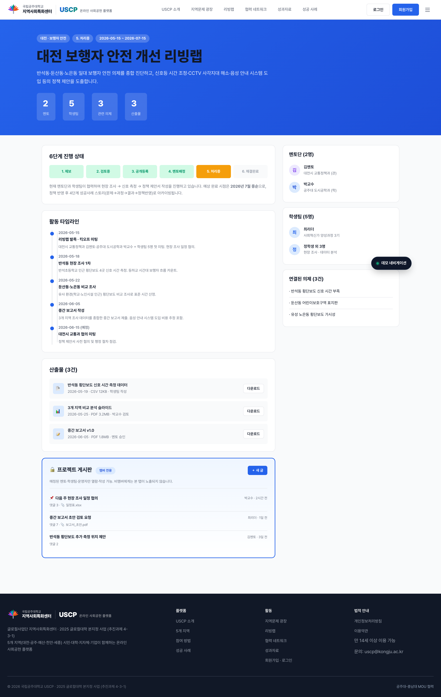 |
| #7 | 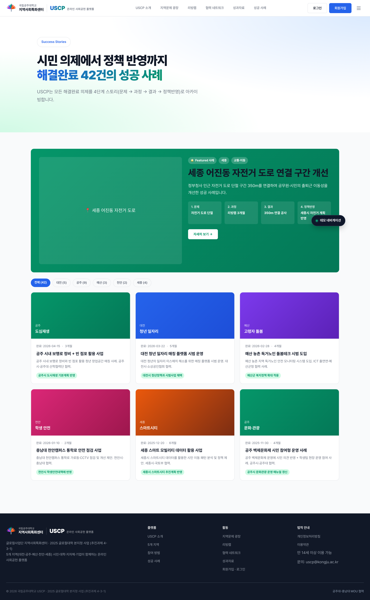 |
| #17 | 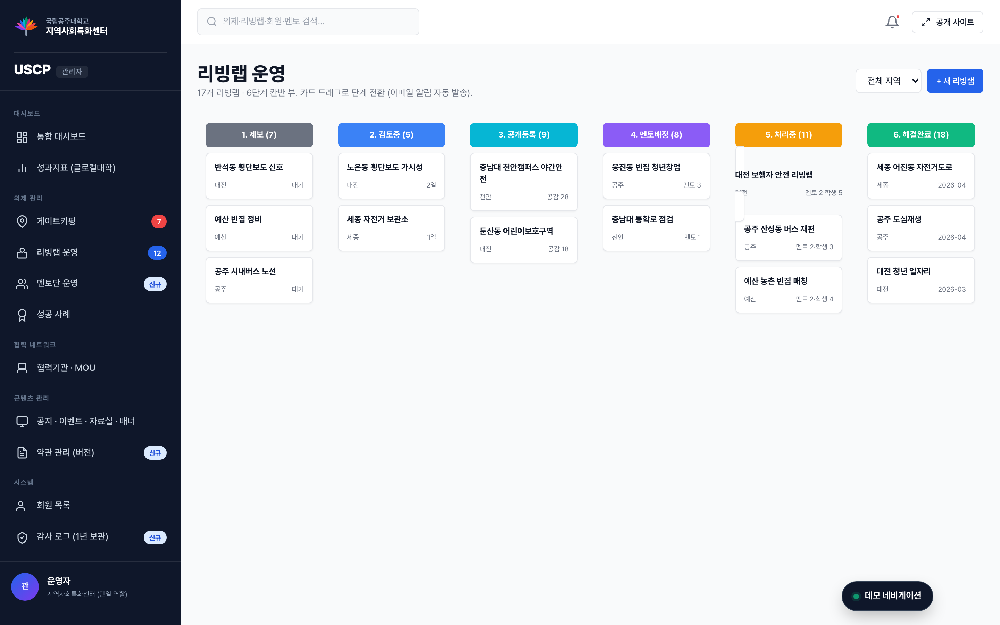 |
| #17b | 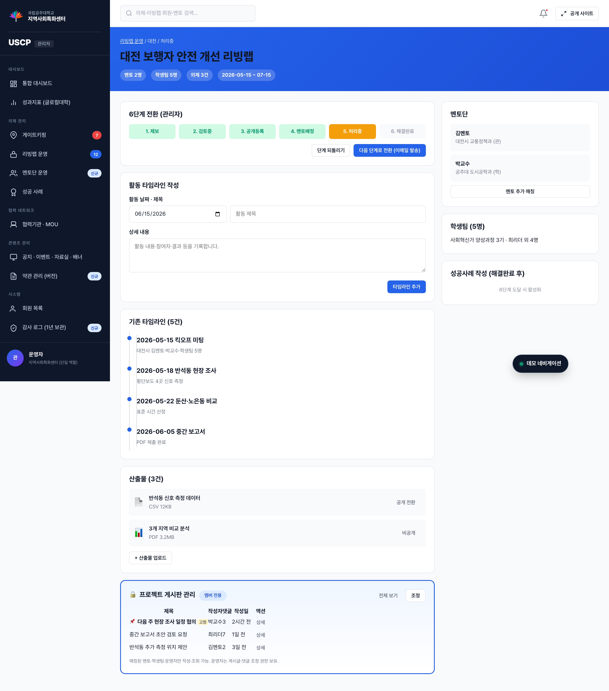 |
| #18 | 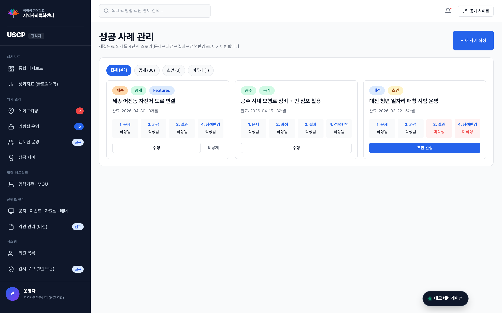 |

### M03-01: 리빙랩 목록 조회
- **목적**: 공개되어 있는 모든 리빙랩 프로젝트를 단계별(모집중·진행중·완료)로 둘러볼 수 있도록 합니다.
- **입력**: 단계 필터, 지역 필터, 정렬 옵션을 선택합니다.
- **권한**: 누구나 (비로그인 포함) 열람할 수 있습니다.
- **유의사항**: 각 프로젝트 카드에는 참여 기관·멤버 수·산출물 수가 함께 표시되어, 어떤 프로젝트가 활발히 진행되는지 직관적으로 파악할 수 있습니다.

### M03-02: 리빙랩 상세 페이지
- **목적**: 단일 리빙랩 프로젝트의 개요·진행 단계·참여 멤버·연관 기관 정보를 한 화면에서 확인할 수 있도록 합니다.
- **입력**: 목록에서 원하는 프로젝트를 클릭하면 상세 페이지로 이동합니다.
- **권한**: 누구나 (비로그인 포함) 열람할 수 있습니다. 단, 게시판 탭은 매칭된 멤버에게만 노출됩니다.
- **유의사항**: 페이지는 탭(정보·타임라인·산출물·게시판)으로 구성되며, 비멤버에게는 게시판 탭 자체가 보이지 않습니다.

### M03-03: 활동 타임라인 조회
- **목적**: 리빙랩의 그동안의 활동 기록(킥오프 미팅·현장조사·중간보고 등)을 날짜순으로 둘러볼 수 있도록 합니다.
- **입력**: 상세 페이지의 "타임라인" 탭으로 이동합니다.
- **권한**: 누구나 (비로그인 포함) 열람할 수 있습니다.
- **유의사항**: 가장 최근 활동이 상단에 표시되며, 활동마다 날짜·제목·간단 설명이 함께 노출됩니다.

### M03-04: 산출물 다운로드
- **목적**: 리빙랩이 생산한 보고서·데이터·사진 등의 산출물을 시민 누구나 다운로드하여 활용할 수 있도록 합니다.
- **입력**: 상세 페이지의 "산출물" 탭에서 단계별 필터로 원하는 자료를 찾아 다운로드 버튼을 클릭합니다.
- **권한**: 누구나 (비로그인 포함) 다운로드할 수 있습니다(본 사업에서는 산출물을 기본적으로 모두 공개).
- **유의사항**: 업로드가 아직 완료되지 않은 산출물은 목록에서 제외됩니다.

### M03-05: 성공사례 스토리 조회
- **목적**: 해결 완료된 의제의 처음부터 끝까지의 과정을 4단계 스토리(문제→과정→결과→정책반영) 형태로 시민이 쉽게 이해할 수 있도록 공개합니다.
- **입력**: 별도 메뉴 또는 성과자료 페이지에서 지역·연도 필터로 사례를 선택합니다.
- **권한**: 누구나 (비로그인 포함) 열람할 수 있습니다.
- **유의사항**: 운영자가 아직 게시하지 않은(임시저장 상태) 성공사례는 일반 사용자에게 표시되지 않습니다.

### M03-06: 리빙랩 등록 (운영자)
- **목적**: 운영자가 새로운 리빙랩 프로젝트를 시스템에 등록하여, 멘토·학생팀 매칭과 활동 기록을 시작할 수 있도록 합니다.
- **입력**: 프로젝트 제목, 한 줄 요약, 지역(5개 중 1개), 연결할 의제(선택 사항), 시작 예정일·종료 예정일.
- **권한**: 운영자만 등록할 수 있습니다.
- **유의사항**: 새로 등록된 프로젝트는 "모집중" 상태로 시작합니다. 이미 다른 프로젝트와 연결된 의제를 중복 연결할 경우 경고가 표시됩니다.

### M03-07: 리빙랩 수정·삭제
- **목적**: 운영자가 등록된 리빙랩의 정보를 수정하거나 잘못 등록된 경우 삭제할 수 있도록 합니다.
- **입력**: 수정 시에는 변경할 필드만 입력하며, 삭제 시에는 프로젝트 ID로 처리합니다.
- **권한**: 운영자만 수정·삭제할 수 있습니다.
- **유의사항**: 이미 완료(해결완료·종료)된 프로젝트는 이력 보존을 위해 삭제할 수 없습니다. 삭제하더라도 연관된 산출물·게시글은 보존됩니다.

### M03-08: 활동 타임라인 작성·수정
- **목적**: 운영자뿐 아니라 매칭된 멘토·학생팀이 자신이 참여하는 프로젝트의 활동(회의·조사·중간보고 등)을 직접 기록·관리할 수 있도록 합니다.
- **입력**: 활동 일자, 제목, 상세 내용(글자 꾸미기·이미지 삽입 가능한 편집기로 작성).
- **권한**: 운영자는 모든 프로젝트, 매칭 멤버는 자신이 참여하는 프로젝트에 한해 작성할 수 있습니다. 수정·삭제는 작성자 본인 또는 운영자가 할 수 있습니다.
- **유의사항**: 미래 일자도 입력 가능하여 "예정된 일정"을 미리 기록할 수 있습니다. 비멤버가 작성을 시도하면 차단되며, 누가 작성했는지가 자동으로 기록됩니다.

### M03-09: 산출물 업로드
- **목적**: 운영자뿐 아니라 매칭된 멘토·학생팀이 자신이 참여하는 프로젝트의 보고서·데이터·사진 등을 직접 업로드할 수 있도록 합니다.
- **입력**: 파일(여러 개 선택 가능), 제목, 단계 분류(어느 단계에 해당하는 산출물인지), 태그.
- **권한**: 운영자는 모든 프로젝트, 매칭 멤버는 자신이 참여하는 프로젝트에 한해 업로드할 수 있습니다.
- **유의사항**: 파일 1개당 100MB까지 허용되며, 누가 업로드했는지(uploader)가 자동으로 기록되어 추후 메타데이터 수정 권한 판단에 사용됩니다. 비멤버가 업로드를 시도하면 차단됩니다.

### M03-10: 산출물 메타데이터 수정
- **목적**: 산출물의 제목·태그·단계 분류를 나중에 수정할 수 있도록 합니다.
- **입력**: 산출물 ID와 수정할 필드(제목·태그·단계).
- **권한**: 운영자는 모든 산출물, 매칭 멤버는 자신이 업로드한 산출물에 한해 수정할 수 있습니다.
- **유의사항**: 다른 멤버가 업로드한 산출물을 수정하려고 하면 차단됩니다. 운영자는 모든 산출물의 메타데이터를 조정할 수 있습니다.

### M03-11: 성공사례 스토리 작성
- **목적**: 해결 완료된 리빙랩의 전체 과정을 시민이 이해하기 쉬운 스토리 형식으로 작성하여 공개합니다.
- **입력**: 4단계 본문 — ① 어떤 문제였는가, ② 어떻게 해결 과정을 진행했는가, ③ 어떤 결과를 얻었는가, ④ 어떤 정책에 반영되었는가(글자 꾸미기·이미지 삽입 가능한 편집기로 작성).
- **권한**: 운영자만 작성할 수 있습니다.
- **유의사항**: "해결 완료" 단계에 도달한 프로젝트에서만 작성할 수 있습니다. 작성 후에도 별도 게시(공개) 절차를 거쳐야 외부에 노출됩니다.

### M03-12: 정책 반영 기록
- **목적**: 성공사례 4단계 중 마지막 "정책반영" 단계에 들어가는 구체적인 정책명·시행일·반영 내용을 별도로 정리합니다.
- **입력**: 정책 이름, 시행일, 반영 내용 본문.
- **권한**: 운영자만 작성할 수 있습니다.
- **유의사항**: 본 정보는 글로컬대학 성과지표 보고에 활용될 수 있어, 가능한 한 정확하게 작성해야 합니다.

### M03-13: 리빙랩 상태 변경
- **목적**: 운영자가 리빙랩 프로젝트의 단계(모집중→진행중→완료)를 수동으로 전환할 수 있도록 합니다.
- **입력**: 프로젝트 ID, 다음 단계.
- **권한**: 운영자만 단계 전환을 할 수 있습니다.
- **유의사항**: 잘못된 순서로 전환을 시도하면(예: 완료에서 모집중으로) 자동으로 차단됩니다. 의제 6단계 라이프사이클과 별개로 동작합니다.

### M03-14: 의제(제보)와 리빙랩 연결
- **목적**: 시민 제보(의제)와 운영자가 등록한 리빙랩 프로젝트를 서로 연결하여, 어떤 제보가 어떤 프로젝트로 발전했는지 추적할 수 있도록 합니다.
- **관계 (H01 결정, N:M)**: 의제와 리빙랩은 **다대다(N:M)** 입니다. 한 리빙랩에 여러 제보를 연결할 수 있고, 한 제보를 여러 리빙랩에 연결할 수도 있습니다. 저장은 `project_issues` join table 단일 진실원천을 사용합니다.
- **입력**: 프로젝트 ID와 연결할 제보 ID (개별 1건씩 추가/해제).
- **권한**: 운영자만 연결·해제할 수 있습니다.
- **유의사항**: 동일 (프로젝트, 제보) 쌍의 중복 연결은 무시(idempotent)되며 오류를 발생시키지 않습니다. 동일 제보를 다른 프로젝트에 연결하는 것은 허용됩니다(N:M). 연결 해제는 해당 쌍 1건만 제거하며 다른 연결은 보존됩니다.

### M03-15: 프로젝트 게시판 — 게시글 작성·수정·삭제
- **목적**: 매칭된 멘토·학생팀·운영자가 프로젝트 내부에서 자유롭게 토론·정보 공유를 할 수 있는 비공개 게시판을 제공합니다.
- **입력**: 게시글 제목(1~100자), 본문(1~5,000자), 첨부파일(선택 사항).
- **권한**: 해당 프로젝트에 매칭된 멤버(멘토·학생팀)와 운영자만 작성할 수 있습니다. 수정·삭제는 작성자 본인 또는 운영자가 할 수 있습니다.
- **유의사항**: 매칭되지 않은 시민 회원이나 비로그인 사용자에게는 게시판 탭 자체가 보이지 않습니다. UI 차단과 시스템 차단이 이중으로 적용되어 외부 유출이 방지됩니다.

### M03-16: 프로젝트 게시판 — 게시글 목록·상세 조회
- **목적**: 매칭된 멤버가 게시판에 등록된 게시글을 목록·상세 형태로 확인할 수 있도록 합니다.
- **입력**: 정렬 옵션(최신순·고정글 우선)을 선택합니다.
- **권한**: 해당 프로젝트에 매칭된 멤버(멘토·학생팀)와 운영자만 열람할 수 있습니다.
- **유의사항**: 비멤버가 접근을 시도하면 차단됩니다.

### M03-17: 프로젝트 게시판 — 댓글
- **목적**: 게시글 하단에 댓글을 작성하여 멤버 간 토론을 이어갈 수 있도록 합니다.
- **입력**: 댓글 본문(1~1,000자).
- **권한**: 해당 프로젝트에 매칭된 멤버와 운영자만 작성할 수 있습니다. 수정·삭제는 작성자 본인 또는 운영자가 할 수 있습니다.
- **유의사항**: 원본 게시글이 삭제되면 해당 댓글도 함께 정리됩니다.

### M03-18: 프로젝트 게시판 — 첨부파일
- **목적**: 게시글당 1개의 파일(회의 자료·일정표·이미지 등)을 첨부하여 멤버 간 공유할 수 있도록 합니다.
- **입력**: 게시글 작성 시 20MB 이내의 파일을 첨부합니다.
- **권한**: 해당 프로젝트에 매칭된 멤버와 운영자만 업로드·다운로드할 수 있습니다.
- **유의사항**: 비멤버가 다운로드를 시도하면 차단됩니다.

---

## M04. 멘토·학생팀 매칭 모듈 (9개)

### 📷 M04 관련 화면

| # | 화면 |
|---|---|
| #19 | 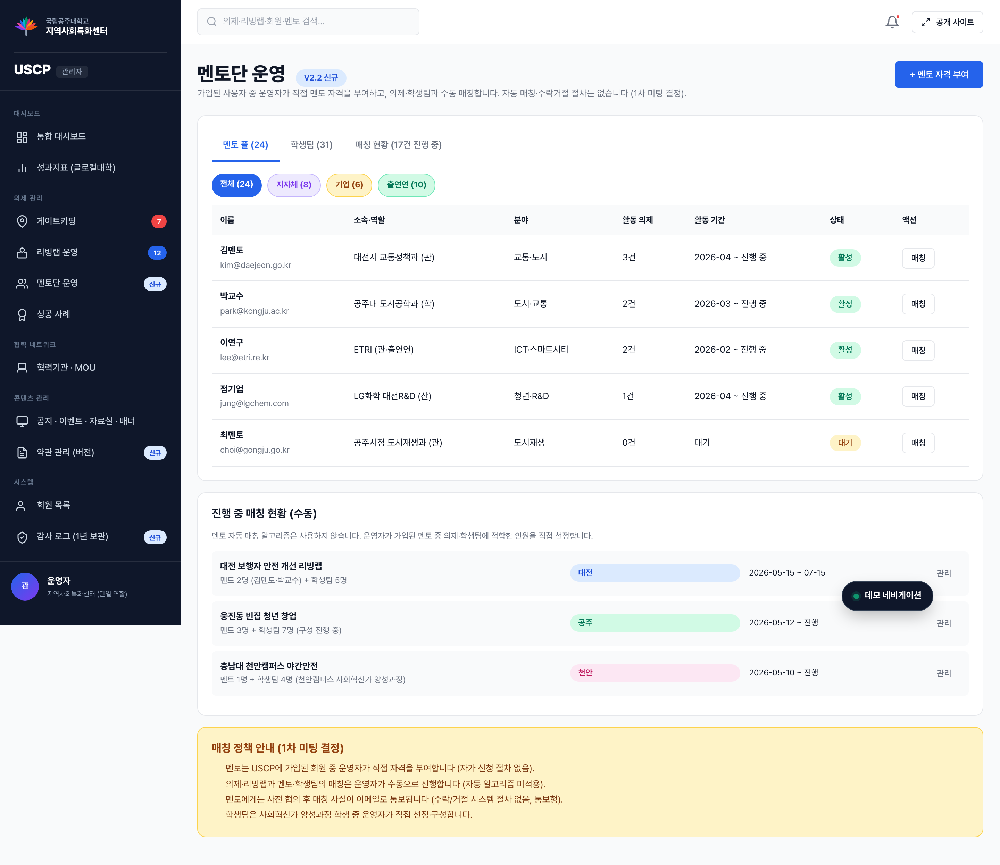 |

### M04-01: 멘토 자격 부여
- **목적**: 운영자가 가입된 시민 회원 중에서 멘토 역할을 맡을 사람을 선정하여 멘토 자격을 부여합니다.
- **입력**: 대상 회원, 소속(예: 대전시 교통정책과·공주대 도시공학과 등), 전문분야 태그.
- **권한**: 운영자만 자격을 부여할 수 있습니다.
- **유의사항**: 이미 멘토 자격이 있는 사용자에게 재부여를 시도하면 안내 메시지와 함께 무시됩니다. 자격 부여 즉시 본인에게 안내 이메일이 발송됩니다.

### M04-02: 멘토 자격 해제
- **목적**: 운영자가 더 이상 멘토 활동을 하지 않는 사용자의 자격을 회수합니다.
- **입력**: 대상 멘토 ID.
- **권한**: 운영자만 자격을 회수할 수 있습니다.
- **유의사항**: 진행 중인 매칭이 남아 있는 경우 경고가 표시되며, 운영자가 별도로 매칭을 해제한 뒤 처리하는 것이 권장됩니다. 자격 회수 후에도 과거 활동 이력은 그대로 보존됩니다.

### M04-03: 멘토 목록·검색
- **목적**: 운영자가 매칭에 적합한 멘토를 빠르게 찾을 수 있도록 멘토 풀을 이름·소속·전문분야로 검색합니다.
- **입력**: 이름 검색어, 소속 필터, 전문분야 필터.
- **권한**: 운영자만 멘토 풀을 검색할 수 있습니다.
- **유의사항**: 자격 해제된 멘토는 기본적으로 목록에서 제외되어 표시됩니다.

### M04-04: 학생팀 구성
- **목적**: 운영자가 가입된 학생 회원들을 묶어 사회혁신가 양성과정 학생팀을 편성합니다.
- **입력**: 팀 이름, 팀장으로 지정할 학생, 팀원으로 지정할 학생들의 명단.
- **권한**: 운영자만 학생팀을 구성할 수 있습니다.
- **유의사항**: 한 학생이 동시에 여러 팀에 소속되는 것은 허용됩니다. 팀 구성과 동시에 팀원들에게 안내 이메일이 발송됩니다.

### M04-05: 학생팀 수정·해체
- **목적**: 운영자가 학생팀의 이름·구성원을 변경하거나 활동이 종료된 팀을 해체합니다.
- **입력**: 팀 ID와 변경할 필드(이름·구성원). 해체 시에는 팀 ID만 입력합니다.
- **권한**: 운영자만 수정·해체할 수 있습니다.
- **유의사항**: 진행 중인 매칭이 있는 팀을 해체하려고 하면 경고가 표시되어 매칭을 먼저 해제하도록 안내합니다.

### M04-06: 의제별 멘토단 매칭
- **목적**: 운영자가 특정 의제·리빙랩 프로젝트에 적합한 멘토와 학생팀을 직접 선정하여 매칭합니다.
- **입력**: 프로젝트 ID, 매칭할 멘토 ID 1명 이상, 학생팀 ID.
- **권한**: 운영자만 매칭을 실행할 수 있습니다.
- **유의사항**: 본 사업에서는 자동 매칭 알고리즘을 사용하지 않으며, 운영자의 판단에 따라 수동으로 매칭됩니다. 같은 프로젝트에 같은 멘토를 중복 매칭하려고 해도 한 번만 처리됩니다.

### M04-07: 매칭 알림 발송
- **목적**: 매칭이 완료되면 즉시 멘토와 학생팀에게 이메일로 안내하여, 별도의 수락·거절 절차 없이 활동을 시작할 수 있도록 합니다.
- **입력**: 별도 사용자 입력 없음 — 매칭이 완료될 때 자동으로 발송됩니다.
- **권한**: 시스템 자동
- **유의사항**: 본 사업에서는 멘토가 매칭을 거절하는 절차 없이 협의 후 등록되는 통보 방식입니다. 메일 발송이 실패하면 자동으로 재시도됩니다.

### M04-08: 멘토단 활동 기록
- **목적**: 매칭된 멘토 본인이 회의·자문·검토 등의 활동을 직접 기록하거나, 운영자가 멘토단의 활동을 대신 기록할 수 있도록 합니다.
- **입력**: 프로젝트 ID, 활동 일자, 활동 유형(회의·자문·검토 중 선택), 활동 요약.
- **권한**: 해당 프로젝트에 매칭된 멘토 본인과 운영자가 작성할 수 있습니다. 수정·삭제는 작성자 본인 또는 운영자가 할 수 있습니다.
- **유의사항**: 학생팀은 본 기능을 직접 사용할 수 없으며, 활동 타임라인(M03-08)을 이용해야 합니다.

### M04-09: 멘토·학생팀 활동 이력 조회
- **목적**: 멘토·학생팀 본인이 자신의 활동 이력을 한눈에 확인하거나, 운영자가 특정 멘토의 전체 활동을 조회할 수 있도록 합니다.
- **입력**: 본인은 마이페이지에서 자동 조회되며, 운영자는 대상 멘토 ID로 조회합니다.
- **권한**: 본인은 자신의 이력만, 운영자는 모든 멘토의 이력을 조회할 수 있습니다.
- **유의사항**: 시간순으로 정렬되어 표시됩니다.

---

## M05. 협력 네트워크 모듈 (9개)

### 📷 M05 관련 화면

| # | 화면 |
|---|---|
| #8 | 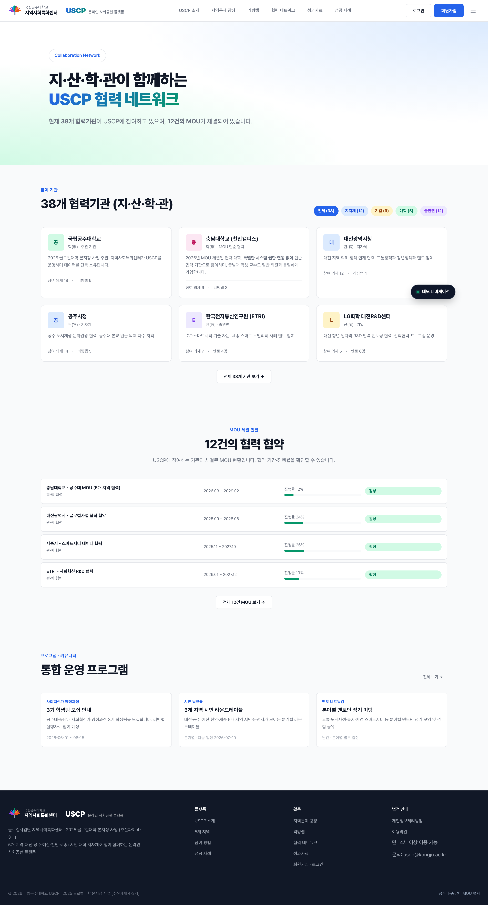 |
| #20 | 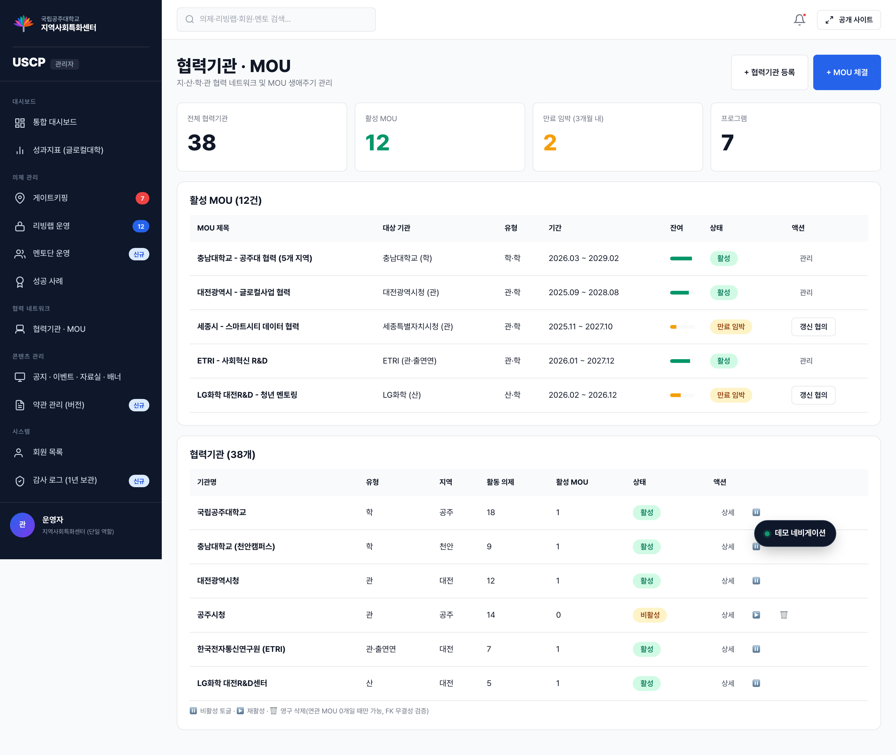 |

### M05-01: 협력기관 등록·수정·삭제
- **목적**: 운영자가 USCP와 협력하는 기관(지자체·산업체·학교·관련 기관)의 정보를 등록·수정·삭제하여 관리합니다.
- **입력**: 기관명, 유형(지·산·학·관 중 1개), 지역, 연락처, 소개글.
- **권한**: 운영자만 등록·수정·삭제할 수 있습니다.
- **유의사항**: 활성 MOU가 체결되어 있는 기관은 데이터 보호를 위해 삭제할 수 없으며, 대신 활성·비활성 토글(M05-09)을 사용하는 것이 권장됩니다.

### M05-02: 협력기관 목록 조회
- **목적**: 시민 누구나 USCP와 협력 중인 기관들을 유형별(지·산·학·관)로 확인할 수 있도록 공개합니다.
- **입력**: 유형 필터를 선택합니다.
- **권한**: 누구나 (비로그인 포함) 열람할 수 있습니다.
- **유의사항**: 운영자가 비활성 처리한 기관은 일반 사용자에게 표시되지 않습니다.

### M05-03: MOU 등록
- **목적**: 운영자가 협력기관과 체결한 MOU(업무협약)의 내용·기간·첨부 파일을 시스템에 등록합니다.
- **입력**: 협약 기관 선택, 협약명, 체결일, 만료일, 협약 내용, 첨부 파일(선택 사항).
- **권한**: 운영자만 등록할 수 있습니다.
- **유의사항**: 만료일이 체결일보다 앞서면 등록이 거부됩니다.

### M05-04: MOU 만료 임박 자동 알림
- **목적**: MOU의 만료일이 30일 앞으로 다가오면 운영자에게 자동으로 이메일을 보내, 갱신·후속 협의를 놓치지 않도록 합니다.
- **입력**: 별도 사용자 입력 없음 — 매일 정해진 시각에 시스템이 자동 점검합니다.
- **권한**: 시스템 자동
- **유의사항**: 동일 MOU에 대해 알림이 한 번 발송되면 다시 발송되지 않습니다.

### M05-05: MOU 목록 조회
- **목적**: 시민이 USCP가 어떤 기관과 어떤 협약을 맺고 있는지(체결중·만료 등 상태 포함) 확인할 수 있도록 공개합니다.
- **입력**: 상태 필터(체결중·만료 등)를 선택합니다.
- **권한**: 누구나 (비로그인 포함) 열람할 수 있습니다.
- **유의사항**: 만료일이 지난 MOU는 자동으로 "만료" 상태로 표시됩니다.

### M05-06: 프로그램 통합 운영 등록
- **목적**: 리빙랩·멘토단·학생팀이 함께 참여하는 통합 프로그램(예: 봉사·교육·연수)을 운영자가 등록·관리합니다.
- **입력**: 프로그램 이름, 연계 프로젝트, 연계 멘토, 연계 학생팀, 설명.
- **권한**: 운영자만 등록할 수 있습니다.
- **유의사항**: 별도 제약 없이 자유롭게 등록·관리할 수 있습니다.

### M05-07: 커뮤니티 게시글 작성·수정
- **목적**: 운영자가 활동 소식·모임 안내 등의 커뮤니티 게시글을 작성하여 시민과 멤버에게 공유합니다.
- **입력**: 게시글 제목, 본문(글자 꾸미기·이미지 삽입 가능한 편집기), 상단 고정 여부.
- **권한**: 운영자만 작성·수정할 수 있습니다.
- **유의사항**: 상단 고정 기능을 활용해 중요한 공지를 상위에 표시할 수 있습니다.

### M05-08: 커뮤니티 댓글 관리
- **목적**: 운영자가 커뮤니티 게시글의 댓글 중 부적절한 내용을 숨기거나 삭제하여 게시판을 건전하게 유지합니다.
- **입력**: 대상 댓글 선택, 처리 방법(숨김·삭제·복원).
- **권한**: 댓글 작성은 시민 회원 이상이 할 수 있으며, 조정은 운영자만 가능합니다.
- **유의사항**: 일반 사용자는 본인이 작성한 댓글만 수정할 수 있으며, 다른 사람의 댓글을 수정할 수 없습니다.

### M05-09: 협력기관 활성·비활성 토글
- **목적**: 협력기관을 완전히 삭제하지 않고 일시적으로 공개 페이지에서 숨길 수 있도록 합니다(이력은 보존).
- **입력**: 기관 ID, 활성 여부 토글.
- **권한**: 운영자만 토글할 수 있습니다.
- **유의사항**: 비활성으로 처리해도 해당 기관과 연결된 MOU·프로그램은 그대로 유지되어 과거 이력이 보존됩니다.

---

## M06. 성과자료 모듈 (8개)

### 📷 M06 관련 화면

| # | 화면 |
|---|---|
| #9 | 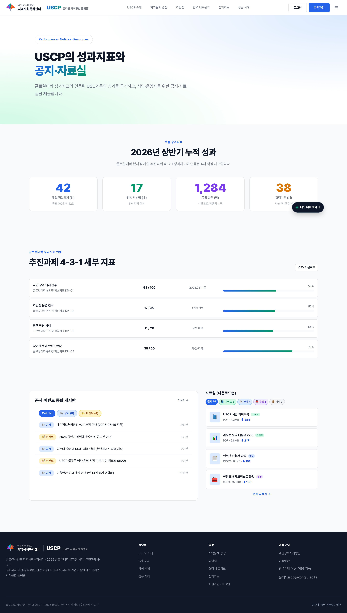 |
| #21 | 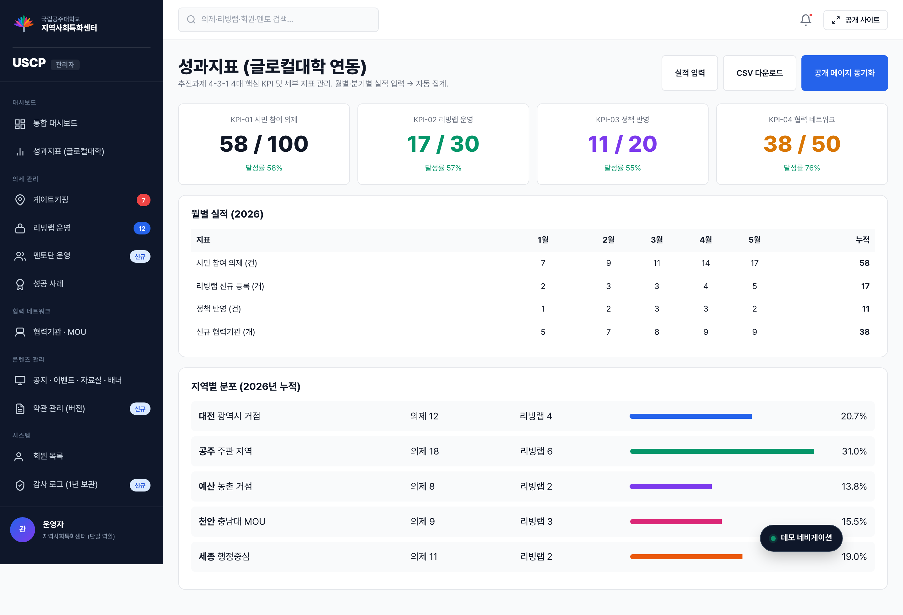 |

### M06-01: 성과지표 등록·수정
- **목적**: 운영자가 글로컬대학 성과지표 등 USCP가 추적할 KPI를 정의·등록·수정합니다.
- **입력**: 지표명, 계산 공식, 단위, 목표값, 자동 집계 대상(선택 사항).
- **권한**: 운영자만 등록·수정할 수 있습니다.
- **유의사항**: 자동 집계 대상을 변경한 경우 과거 실적을 다시 계산할지 선택할 수 있습니다.

### M06-02: 성과지표 목록 조회
- **목적**: 시민과 운영자가 USCP의 누적 성과지표 현황을 확인할 수 있도록 공개합니다.
- **입력**: 조회 기간 필터(선택 사항).
- **권한**: 누구나 (비로그인 포함) 열람할 수 있습니다.
- **유의사항**: 각 지표는 목표 대비 달성률(%)이 함께 표시됩니다.

### M06-03: 실적 입력 (월별·분기별)
- **목적**: 운영자가 수동으로 입력해야 하는 KPI 실적(예: 운영 워크숍 횟수)을 월별·분기별로 등록합니다.
- **입력**: 대상 지표, 기간(YYYY-MM 또는 YYYY-Q 형식), 실적 값.
- **권한**: 운영자만 입력할 수 있습니다.
- **유의사항**: 같은 기간에 중복 입력하면 기존 값을 덮어쓰기로 처리합니다(별도 오류 없음).

### M06-04: 자동 집계
- **목적**: 시스템 이용 데이터(예: 해결완료 의제 건수)를 시스템이 자동으로 집계하여 KPI에 반영합니다.
- **입력**: 별도 사용자 입력 없음 — 의제가 "해결완료"로 종결될 때 자동으로 카운트 1이 증가합니다.
- **권한**: 시스템 자동
- **유의사항**: 같은 의제가 두 번 카운트되지 않도록 자동으로 방지됩니다.

### M06-05: 성과지표 대시보드
- **목적**: 운영자와 시민이 KPI 진척률을 차트로 시각화하여 한눈에 확인할 수 있도록 합니다.
- **입력**: 별도 입력 없이 대시보드 페이지에 접속하면 자동 표시됩니다.
- **권한**: 관리자 대시보드는 운영자만, 공개 대시보드(단순화 버전)는 누구나 (비로그인 포함) 이용할 수 있습니다.
- **유의사항**: 최근 12개월 추이를 막대·선 차트로 표시합니다.

### M06-06: 엑셀/CSV 다운로드
- **목적**: 운영자가 외부 보고서 작성을 위해 KPI 실적 데이터를 엑셀 또는 CSV 파일로 받을 수 있도록 합니다.
- **입력**: 조회 시작일, 종료일, 다운로드할 지표를 선택합니다.
- **권한**: 운영자만 다운로드할 수 있습니다.
- **유의사항**: 본 사업 규모에서는 즉시 다운로드되며, 별도 대기 없이 받을 수 있습니다.

### M06-07: 공지·이벤트 통합 게시판 조회 (성과자료 영역)
- **목적**: 시민이 운영자가 등록한 공지사항과 이벤트 안내를 하나의 게시판에서 한 번에 확인할 수 있도록 합니다.
- **입력**: 카테고리 필터(전체·공지·이벤트)를 선택합니다.
- **권한**: 누구나 (비로그인 포함) 열람할 수 있습니다.
- **유의사항**: 아직 게시되지 않은(임시저장) 항목은 표시되지 않습니다. 각 항목에는 "공지" 또는 "이벤트" 배지가 표시되어 종류를 쉽게 구분할 수 있습니다.

### M06-08: 자료실
- **목적**: 시민이 리빙랩 운영 가이드·신청 양식·체크리스트 등의 자료를 자유롭게 다운로드할 수 있도록 합니다.
- **입력**: 카테고리 필터(가이드·양식·툴킷·기타)를 선택하여 원하는 자료를 찾습니다.
- **권한**: 다운로드는 누구나 (비로그인 포함), 삭제는 운영자만 가능합니다.
- **유의사항**: 자료 옆에는 누적 다운로드 횟수가 표시되어 인기 자료를 한눈에 알 수 있습니다.

---

## M07. 콘텐츠 관리 모듈 (16개)

### 📷 M07 관련 화면

| # | 화면 |
|---|---|
| #22 | 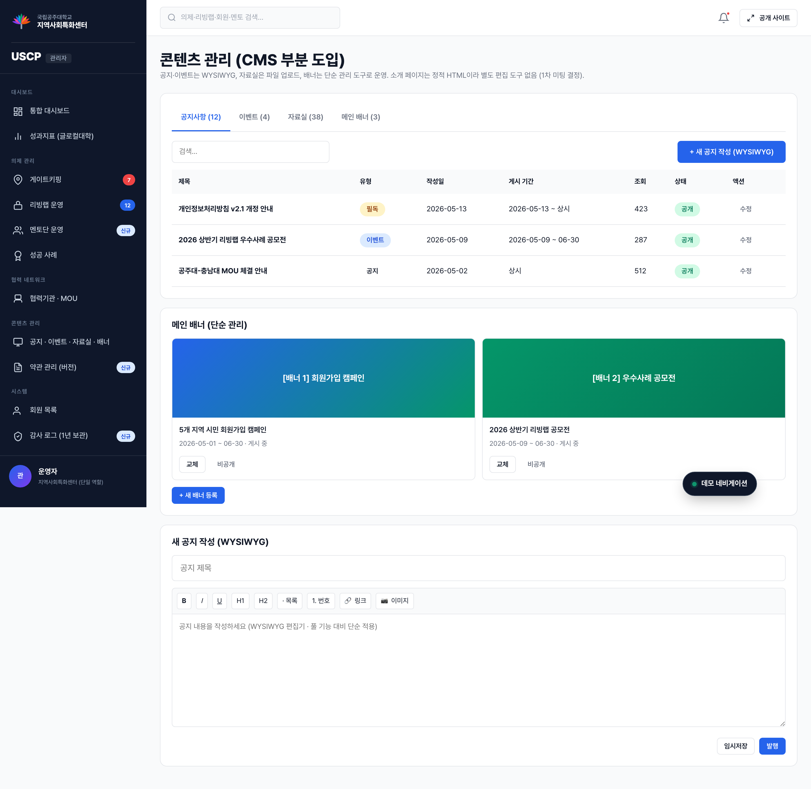 |
| #23 | 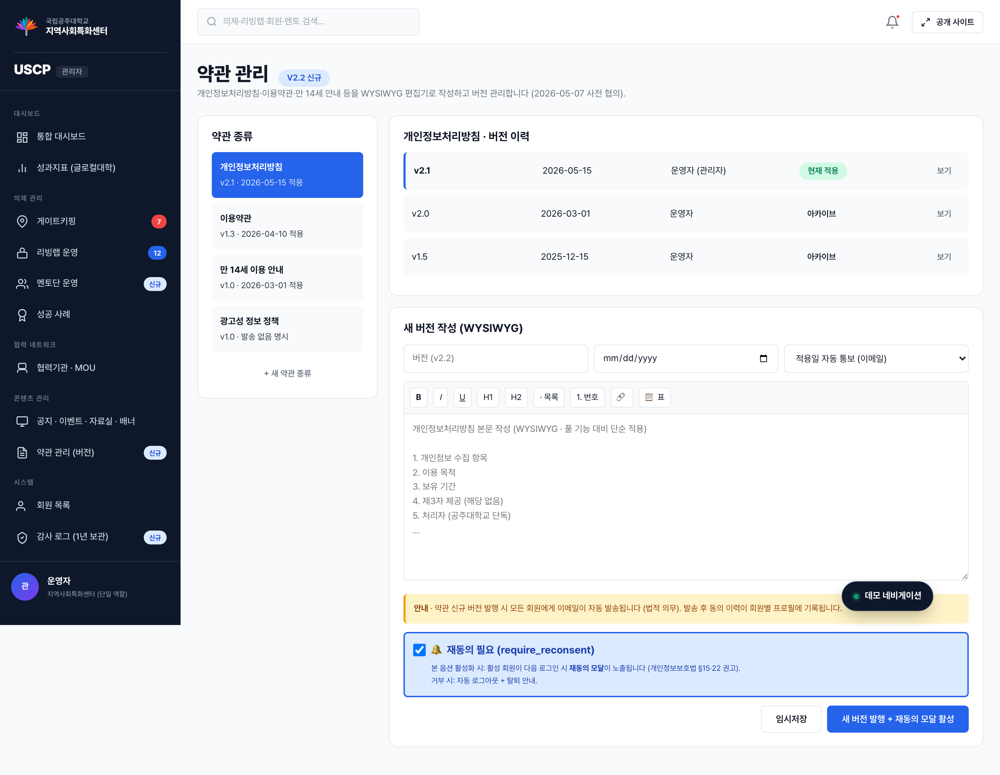 |

### M07-01: 공지사항 작성
- **목적**: 운영자가 시민에게 알려야 할 공지사항을 글자 꾸미기·이미지 삽입이 가능한 편집기로 작성합니다.
- **입력**: 제목, 본문(워드프로세서 형태의 편집기 사용), 상단 고정 여부, 게시일.
- **권한**: 운영자만 작성할 수 있습니다.
- **유의사항**: 외부에서 불러오는 위험한 스크립트는 자동으로 차단되어 안전하게 게시됩니다.

### M07-02: 공지사항 수정·삭제
- **목적**: 운영자가 이미 등록된 공지사항의 내용을 수정하거나 잘못 등록된 공지를 삭제합니다.
- **입력**: 대상 공지 ID와 수정할 내용. 삭제 시에는 ID만 입력합니다.
- **권한**: 운영자만 수정·삭제할 수 있습니다.
- **유의사항**: 이미 시민에게 노출된 공지를 삭제하는 경우 경고 메시지가 표시됩니다.

### M07-03: 이벤트 공지 작성
- **목적**: 운영자가 워크숍·공모전·모임 등의 이벤트 안내를 글자 꾸미기 편집기로 작성합니다.
- **입력**: 공지사항과 동일한 입력 + 이벤트 일자(선택 사항).
- **권한**: 운영자만 작성할 수 있습니다.
- **유의사항**: 공지사항과 함께 통합 게시판에 노출되며, "이벤트" 배지로 구분됩니다.

### M07-04: 이벤트 공지 수정·삭제
- **목적**: 운영자가 등록된 이벤트 공지를 수정·삭제합니다.
- **입력**: 공지사항 수정·삭제와 동일합니다.
- **권한**: 운영자만 수정·삭제할 수 있습니다.
- **유의사항**: 동일합니다.

### M07-05: 자료실 파일 업로드
- **목적**: 운영자가 자료실에 가이드·양식·툴킷 등의 파일을 업로드합니다.
- **입력**: 파일(여러 개 선택 가능), 제목, 태그, 카테고리(가이드·양식·툴킷·기타 중 1개).
- **권한**: 운영자만 업로드할 수 있습니다.
- **유의사항**: 파일 1개당 100MB까지 허용됩니다.

### M07-06: 자료실 파일 다운로드·삭제
- **목적**: 시민이 자료실에서 자료를 다운로드하거나, 운영자가 잘못 올린 자료를 삭제합니다.
- **입력**: 다운로드는 자료 옆 "다운로드" 버튼 클릭. 삭제는 운영자가 자료 ID로 처리합니다.
- **권한**: 다운로드는 누구나 (비로그인 포함), 삭제는 운영자만 가능합니다.
- **유의사항**: 이미 삭제된 자료를 다운로드하려고 하면 "더 이상 제공되지 않습니다" 안내가 표시됩니다.

### M07-07: 배너 이미지 업로드
- **목적**: 운영자가 메인 화면 상단에 표시할 배너 이미지를 업로드합니다.
- **입력**: 이미지 파일(권장 크기 1920x600), 제목, 클릭 시 이동할 URL, 노출 순서.
- **권한**: 운영자만 업로드할 수 있습니다.
- **유의사항**: 이미지가 아닌 파일은 자동으로 차단됩니다.

### M07-08: 배너 활성화·노출 순서 변경
- **목적**: 운영자가 등록된 배너를 표시/숨김 처리하거나 노출 순서를 조정합니다.
- **입력**: 배너 ID, 활성화 여부 토글, 순서 번호.
- **권한**: 운영자만 변경할 수 있습니다.
- **유의사항**: 본 사업에서는 시간 예약 스케줄 기능은 포함되지 않으며, 단순 표시/숨김 + 순서 조정만 제공합니다.

### M07-09: 배너 클릭 시 연결 URL 설정
- **목적**: 시민이 배너를 클릭했을 때 이동할 외부 또는 내부 페이지 주소를 설정합니다.
- **입력**: 배너 ID, 연결할 URL.
- **권한**: 운영자만 설정할 수 있습니다.
- **유의사항**: 보안을 위해 위험한 형식(예: javascript:)의 주소는 자동으로 차단됩니다.

### M07-10: 이용약관 편집
- **목적**: 운영자가 시민에게 보여지는 이용약관 본문을 글자 꾸미기 편집기로 직접 작성·수정합니다.
- **입력**: 약관 본문(편집기로 작성).
- **권한**: 운영자만 편집할 수 있습니다.
- **유의사항**: 새 약관을 발행하기 전에 미리보기 모달에서 최종 확인할 수 있도록 UI가 제공됩니다.

### M07-11: 개인정보처리방침 편집
- **목적**: 운영자가 시민에게 보여지는 개인정보처리방침 본문을 글자 꾸미기 편집기로 직접 작성·수정합니다.
- **입력**: 처리방침 본문(편집기로 작성).
- **권한**: 운영자만 편집할 수 있습니다.
- **유의사항**: 이용약관과 동일한 절차로 발행됩니다.

### M07-12: 약관 버전 관리
- **목적**: 약관이 개정될 때마다 새 버전을 발행하고 시행일·이력을 자동으로 관리합니다.
- **입력**: 약관 종류(이용약관·개인정보처리방침), 본문, 시행일.
- **권한**: 운영자만 발행할 수 있습니다.
- **유의사항**: 일단 발행된 버전의 본문은 수정할 수 없으며, 수정이 필요하면 새 버전을 다시 발행해야 합니다(법적 추적성 확보 목적).

### M07-13: 약관 동의 이력 기록
- **목적**: 회원별로 언제 어떤 버전의 약관에 동의했는지 자동으로 기록하여, 법적 분쟁 시 증빙으로 활용합니다.
- **입력**: 별도 사용자 입력 없음 — 회원가입 시점과 약관 재동의 시점에 시스템이 자동으로 기록합니다.
- **권한**: 시스템 자동
- **유의사항**: 마이페이지에서 본인이 동의한 약관 버전을 확인할 수 있습니다.

### M07-14: 약관 변경 시 재동의 요청 모달
- **목적**: 약관이 중요하게 개정된 경우, 다음 로그인 시 변경된 약관을 회원에게 다시 동의받아 법적 권고 사항을 충족합니다.
- **입력**: 운영자가 새 약관 발행 시 "재동의 필요" 체크박스를 선택하면 활성화됩니다.
- **권한**: 재동의 요청 발행은 운영자, 재동의 응답은 시민 회원 이상의 로그인된 사용자가 합니다.
- **유의사항**: 재동의를 거부하면 자동으로 로그아웃 처리되며, 탈퇴 안내가 제공됩니다. 본 절차는 개인정보보호법 권고 사항을 따르는 안전 조치입니다.

### M07-15: 자료실 카테고리 분류
- **목적**: 자료실 파일을 4가지 카테고리(가이드·양식·툴킷·기타)로 분류하여 시민이 원하는 자료를 빠르게 찾을 수 있도록 합니다.
- **입력**: 자료 업로드 시 운영자가 카테고리를 선택합니다.
- **권한**: 카테고리 지정은 운영자, 카테고리 탭 사용은 누구나 (비로그인 포함) 가능합니다.
- **유의사항**: 자료실 페이지 상단에 카테고리 탭이 표시되어 필터링이 한 번의 클릭으로 가능합니다.

### M07-16: 자료실 다운로드 횟수 자동 집계
- **목적**: 시민이 자료를 다운로드할 때마다 누적 횟수를 자동으로 기록하여, 운영자가 어떤 자료가 인기 있는지 파악할 수 있도록 합니다.
- **입력**: 별도 사용자 입력 없음 — 다운로드가 발생할 때마다 시스템이 자동으로 횟수를 1 증가시킵니다.
- **권한**: 시스템 자동
- **유의사항**: 같은 사용자가 1분 이내에 여러 번 같은 파일을 다운로드해도 1회로만 집계되어 정확한 통계를 보장합니다.

---

## M08. 권한·감사 모듈 (10개)

### 📷 M08 관련 화면

| # | 화면 |
|---|---|
| #24 | 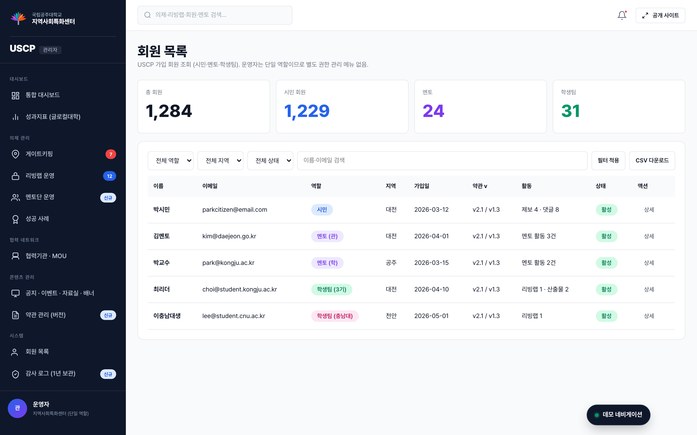 |
| #24b | 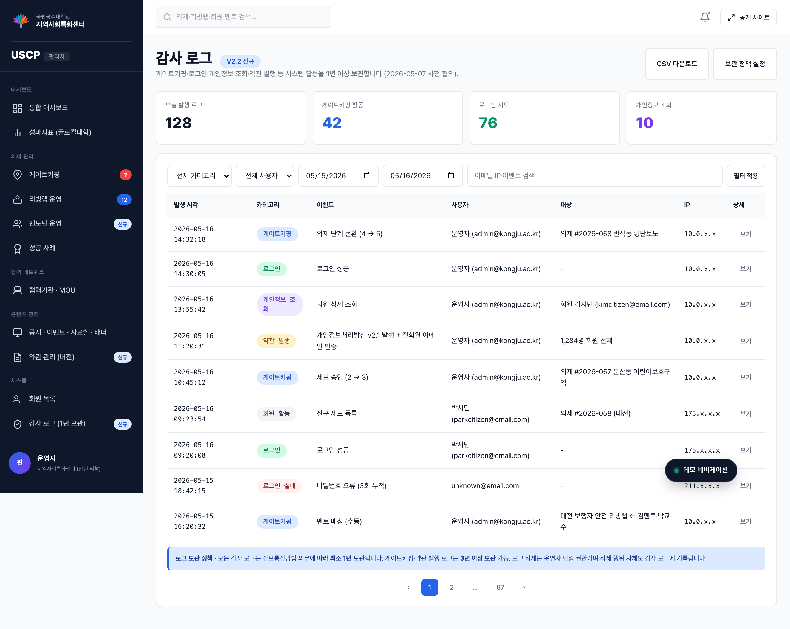 |

### M08-01: 운영자 계정 추가
- **목적**: 기존 운영자가 새로운 운영자 계정을 발급하여 함께 USCP를 관리할 수 있도록 합니다.
- **입력**: 신규 운영자의 이메일, 이름, 임시 비밀번호.
- **권한**: 운영자만 신규 운영자를 추가할 수 있습니다.
- **유의사항**: 이미 가입된 이메일로는 추가할 수 없으며, 발급 즉시 신규 운영자에게 안내 메일이 발송됩니다.

### M08-02: 운영자 계정 삭제·비활성화
- **목적**: 더 이상 USCP를 운영하지 않는 운영자의 계정을 회수합니다.
- **입력**: 대상 운영자 ID, 처리 방법(비활성화·삭제).
- **권한**: 운영자만 처리할 수 있습니다.
- **유의사항**: 본인 계정은 직접 삭제할 수 없으며, 다른 운영자가 처리해야 합니다(상호 견제). 삭제 처리 후에도 90일간 데이터가 보존된 뒤 완전히 파기됩니다.

### M08-03: 사용자 목록·검색
- **목적**: 운영자가 시민 회원·운영자·멘토를 통합적으로 검색·조회하여 관리 업무를 수행할 수 있도록 합니다.
- **입력**: 이름·이메일 검색어, 역할 필터(시민·운영자·멘토 등), 상태 필터(활성·정지·탈퇴).
- **권한**: 운영자만 사용자 정보를 조회할 수 있습니다.
- **유의사항**: 운영자가 회원의 개인정보(생년월일 등)를 조회할 때마다 자동으로 감사 로그에 기록되어 사후 추적이 가능합니다.

### M08-04: 로그인 이력 기록
- **목적**: 모든 로그인 시도(성공·실패 포함)를 자동으로 기록하여 보안 사고 발생 시 추적할 수 있도록 합니다.
- **입력**: 별도 사용자 입력 없음 — 로그인 시도가 발생할 때마다 자동으로 기록됩니다.
- **권한**: 시스템 자동
- **유의사항**: 접속 IP·접속 기기 정보·실패 사유(비밀번호 오류 등)가 함께 기록됩니다.

### M08-05: 게이트키핑 이력 기록
- **목적**: 운영자의 모든 게이트키핑 행위(승인·반려·단계 전환·트랙 변경)를 자동 기록하여 책임 추적이 가능하도록 합니다.
- **입력**: 별도 사용자 입력 없음 — 게이트키핑 작업이 발생할 때마다 자동으로 기록됩니다.
- **권한**: 시스템 자동
- **유의사항**: 누가·언제·어떤 단계로 전환했는지 모든 정보가 보존됩니다.

### M08-06: 개인정보 조회 로그
- **목적**: 운영자가 시민 회원의 개인정보를 조회할 때마다 자동으로 기록하여 개인정보보호법 의무 사항을 충족합니다.
- **입력**: 별도 사용자 입력 없음 — 개인정보 조회가 발생할 때마다 자동으로 기록됩니다.
- **권한**: 시스템 자동
- **유의사항**: 누가·언제·어떤 회원의 정보를 조회했는지 상세히 기록되어 외부 감사에 대응할 수 있습니다.

### M08-07: 시스템 활동 로그
- **목적**: 콘텐츠 작성·수정·삭제 등 운영자의 모든 시스템 활동을 자동으로 기록합니다.
- **입력**: 별도 사용자 입력 없음 — 시스템 변경 작업이 발생할 때마다 자동으로 기록됩니다.
- **권한**: 시스템 자동
- **유의사항**: 단순 조회(보기) 행위는 기록되지 않으며, 데이터를 변경하는 행위만 기록되어 효율성을 확보합니다.

### M08-08: 감사 로그 조회 화면
- **목적**: 운영자가 시스템에 기록된 모든 감사 이력을 기간·작업자·작업 종류 등으로 필터하여 확인할 수 있도록 합니다.
- **입력**: 시작일, 종료일, 대상 작업자, 작업 종류 필터.
- **권한**: 운영자만 조회할 수 있습니다.
- **유의사항**: 본인이 수행한 작업은 별도로 구분 표시되어 자가 점검이 가능합니다.

### M08-09: 로그 보관 정책
- **목적**: 감사 로그를 법적 의무에 따라 최소 1년 보관 후 자동으로 정리합니다.
- **입력**: 별도 사용자 입력 없음 — 매일 자동으로 실행됩니다.
- **권한**: 시스템 자동
- **유의사항**: 개인정보 동의 이력 같은 법적 의무 항목은 1년이 아닌 5년 보관 등 별도 정책이 적용됩니다.

### M08-10: WCAG 2.1 AA 접근성 준수
- **목적**: 시각·청각 장애인을 포함한 모든 시민이 USCP를 동등하게 이용할 수 있도록 공공기관 의무 접근성 표준을 준수합니다.
- **입력**: 시범운영 직전에 운영자가 접근성 검증을 실시합니다.
- **권한**: 검증 수행은 운영자, 접근성 혜택은 모든 사용자가 받습니다.
- **유의사항**: 다음 5가지를 핵심 검증 항목으로 적용합니다 — ① 헤딩(제목) 구조의 논리적 순서, ② 키보드만으로 모든 기능 접근 가능, ③ 이미지에 대체 텍스트 제공, ④ 글자와 배경의 명도 대비 4.5:1 이상, ⑤ 스크린 리더(시각장애인 보조 프로그램) 호환. 검증은 표준 도구(Lighthouse·axe DevTools)로 진행되며, 위반 사항이 0건이 될 때까지 개선합니다. 카카오맵 같은 외부 임베드 콘텐츠는 검증 예외 대상입니다.

---

## M09. 공통 컴포넌트 모듈 (12개)

### 📷 M09 관련 화면

| # | 화면 |
|---|---|
| #1 | 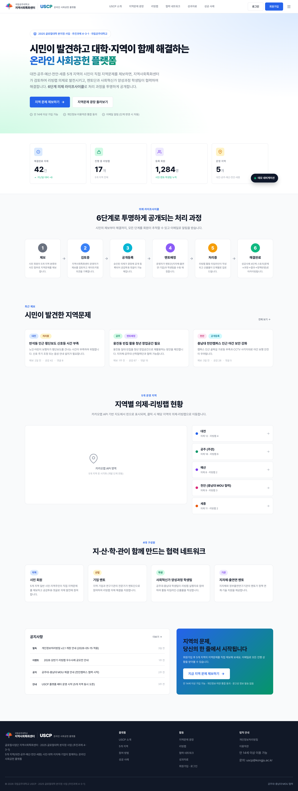 |
| #2 | 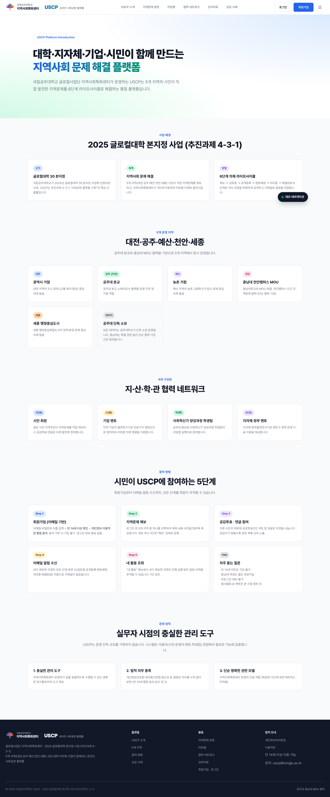 |
| #12 | 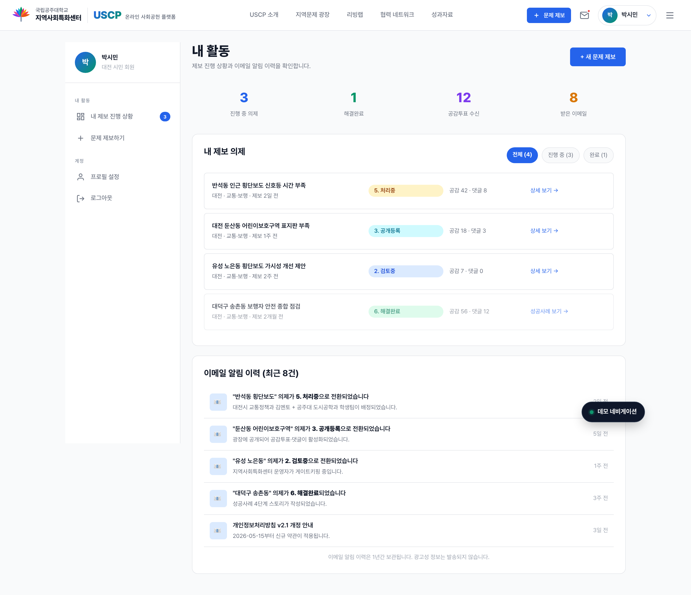 |
| #14 | 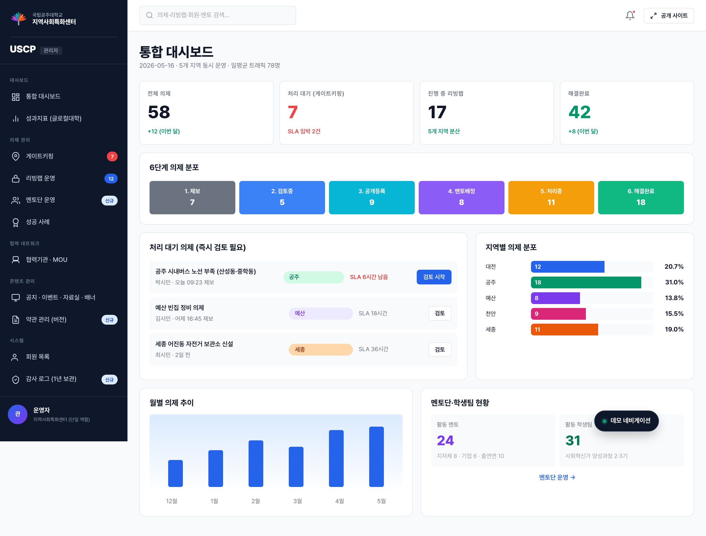 |

### M09-01: 홈 화면 통계 카드
- **목적**: 메인 화면 상단에 USCP의 핵심 운영 현황(운영 지역 수·진행중 리빙랩 수·해결완료 수)을 한눈에 보여주어 방문자의 관심을 유도합니다.
- **입력**: 별도 사용자 입력 없음 — 시스템이 자동으로 최신 현황을 표시합니다.
- **권한**: 누구나 (비로그인 포함) 볼 수 있습니다.
- **유의사항**: 응답 속도 향상을 위해 1분 단위로 캐시되며, 캐시가 없을 때는 즉시 데이터베이스에서 조회하여 표시합니다.

### M09-02: 6단계 프로세스 안내 바
- **목적**: 메인 화면에 의제가 시민 제보부터 해결완료까지 거치는 6단계 라이프사이클(제보·검토중·공개등록·멘토배정·처리중·해결완료)을 시각적으로 안내합니다.
- **입력**: 별도 입력 없음 — 정적 그래픽으로 표시됩니다.
- **권한**: 누구나 (비로그인 포함) 볼 수 있습니다.
- **유의사항**: 동작 없는 안내용 시각 요소입니다.

### M09-03: 최근 제보 카드 위젯
- **목적**: 메인 화면에 가장 최근에 공개 등록된 제보 3건을 카드 형태로 표시하여 시민의 참여를 유도합니다.
- **입력**: 별도 입력 없음 — 시스템이 자동으로 최신 3건을 표시합니다.
- **권한**: 누구나 (비로그인 포함) 볼 수 있습니다.
- **유의사항**: 5분 단위로 캐시됩니다.

### M09-04: 관리자 대시보드
- **목적**: 운영자가 로그인 후 가장 먼저 보는 관리자 화면에 전체 현황·처리 대기 큐·KPI 차트를 통합 표시하여 효율적 운영을 돕습니다.
- **입력**: 별도 입력 없음 — 시스템이 자동으로 종합 데이터를 표시합니다.
- **권한**: 운영자만 접근할 수 있습니다.
- **유의사항**: 게이트키핑 큐의 상위 5건이 미리 보기로 표시되어 즉시 처리할 수 있도록 합니다.

### M09-05: 5개 지역 현황 지도
- **목적**: 메인 화면·광장 페이지에 카카오맵을 활용한 지도 위에 5개 지역(대전·공주·예산·천안·세종)을 핀으로 표시하여 시민이 자신의 지역 현황을 직관적으로 파악할 수 있도록 합니다.
- **입력**: 별도 입력 없음 — 지역별 통계가 자동으로 핀에 표시됩니다.
- **권한**: 누구나 (비로그인 포함) 볼 수 있습니다.
- **유의사항**: 카카오맵 서비스가 일시 장애로 로드되지 않을 경우, 정적 지도 이미지로 자동 대체되어 화면이 깨지지 않습니다.

### M09-06: 의제·리빙랩 위치 표시
- **목적**: 카카오맵 위에 개별 의제와 리빙랩 프로젝트의 위치를 마커로 표시하여, 시민이 자기 동네 의제를 쉽게 발견할 수 있도록 합니다.
- **입력**: 별도 입력 없음 — 각 의제·프로젝트의 위치 정보가 자동으로 표시됩니다.
- **권한**: 누구나 (비로그인 포함) 볼 수 있습니다.
- **유의사항**: 위치 정보가 누락된 의제는 해당 지역의 중심 좌표로 자동 표시됩니다.

### M09-07: 이메일 발송 대기열
- **목적**: 모든 이메일(단계 변경·매칭 알림·약관 안내 등)을 안정적으로 발송하기 위해 비동기 대기열에서 순차 발송하고, 실패 시 자동 재시도합니다.
- **입력**: 별도 사용자 입력 없음 — 다른 기능에서 이메일 발송이 필요할 때 자동으로 대기열에 등록됩니다.
- **권한**: 시스템 자동
- **유의사항**: 발송 실패 시 점진적으로 간격을 늘려가며 최대 5회까지 자동 재시도합니다. 모든 재시도가 실패하면 운영자에게 별도 알림이 전송됩니다.

### M09-08: SMTP 연동 (이메일 발송 서버)
- **목적**: USCP가 외부 이메일 서버와 안전한 인증·암호화 통신으로 이메일을 발송합니다.
- **입력**: 운영 환경에 SMTP 서버 정보(주소·포트·계정·암호·발신자 이메일)를 설정합니다(초기 1회).
- **권한**: 시스템 (설정은 운영 인프라 관리자)
- **유의사항**: SMTP 인증이 실패하면 재시도하지 않고 즉시 알림이 발생하여 빠른 대응이 가능합니다.

### M09-09: 이메일 본문 템플릿
- **목적**: 단계 변경 안내·매칭 통보·계정 관련 안내 등 모든 자동 발송 이메일에 일관된 디자인과 문구를 적용하기 위한 템플릿 관리 기능입니다.
- **입력**: 템플릿 ID와 본문에 채울 정보(예: 회원 이름, 의제 제목 등).
- **권한**: 시스템 자동 (템플릿 자체의 편집은 개발 단계에서 진행)
- **유의사항**: 특정 템플릿이 누락되어도 기본 템플릿이 대신 사용되어 발송이 중단되지 않습니다.

### M09-10: 헤더 (GNB)
- **목적**: 모든 페이지 상단에 일관된 글로벌 메뉴(로고·주요 메뉴·로그인 상태)를 표시하여 시민이 어느 페이지에서도 쉽게 이동할 수 있도록 합니다.
- **입력**: 별도 입력 없음 — 사용자 로그인 상태에 따라 동적으로 표시됩니다.
- **권한**: 누구나 (비로그인 포함) 볼 수 있으며, 일부 메뉴는 로그인 상태에 따라 다르게 표시됩니다.
- **유의사항**: 모바일 화면에서는 자동으로 햄버거 메뉴(가로 3줄 아이콘)로 전환됩니다.

### M09-11: 푸터
- **목적**: 모든 페이지 하단에 기관 정보·약관·개인정보처리방침·저작권 정보를 일관되게 표시합니다.
- **입력**: 별도 입력 없음 — 정적 콘텐츠로 표시됩니다.
- **권한**: 누구나 (비로그인 포함) 볼 수 있습니다.
- **유의사항**: 약관·개인정보처리방침 링크가 항상 노출되어 법적 의무를 충족합니다.

### M09-12: 반응형 레이아웃 (PC·태블릿·모바일)
- **목적**: PC·태블릿·휴대폰 어떤 기기에서도 화면 크기에 맞게 자동으로 레이아웃이 조정되어 편리하게 이용할 수 있도록 합니다.
- **입력**: 별도 입력 없음 — 시스템이 자동으로 기기 화면 크기를 감지합니다.
- **권한**: 누구나 (비로그인 포함) 모든 기기에서 이용할 수 있습니다.
- **유의사항**: Chrome·Safari·Edge·Firefox 등 최신 2개 버전의 브라우저를 지원합니다. 매우 오래된 브라우저(예: 인터넷 익스플로러)는 지원하지 않습니다.

---

## 부록 A. 권한별 접근 가능 기능 한눈에 보기

본 표는 어떤 사용자 유형이 어떤 영역의 기능을 사용할 수 있는지 한눈에 정리한 매트릭스입니다.

| 기능 영역 | 누구나 (비로그인 포함) | 시민 회원 | 멘토/학생팀 | 매칭 멤버 | 운영자 |
|---|:---:|:---:|:---:|:---:|:---:|
| 공개 페이지 조회 (홈·소개·광장·리빙랩·네트워크·성과자료·약관) | ✅ | ✅ | ✅ | ✅ | ✅ |
| 회원가입·로그인·비밀번호 재설정 | ✅ | — | — | — | — |
| 지역문제 제보·공감투표·댓글 작성 | — | ✅ | ✅ | ✅ | ✅ |
| 본인 프로필 조회·수정·내 활동 조회 | — | ✅ | ✅ | ✅ | ✅ |
| 프로젝트 게시판 (게시글·댓글·첨부) | — | — | (매칭 시) ✅ | ✅ | ✅ |
| **프로젝트 활동 타임라인 작성** | — | — | **(매칭 시) ✅ 본인 작성** | **✅ 본인 작성** | ✅ (전체 조정) |
| **프로젝트 산출물 업로드·메타데이터 수정** | — | — | **(매칭 시) ✅ 업로드자 본인** | **✅** | ✅ (전체 조정) |
| **멘토단 활동 기록** | — | — | **매칭 멘토 본인만 ✅** | (멘토일 때만) | ✅ |
| 게이트키핑·리빙랩 관리·멘토 매칭 | — | — | — | — | ✅ |
| 협력 네트워크·성과지표·콘텐츠 관리 | — | — | — | — | ✅ |
| 운영자 계정 관리·감사 로그 조회 | — | — | — | — | ✅ |
| 댓글 수정·삭제 (조정) | — | 본인 댓글만 | 본인 댓글만 | 본인 댓글만 | ✅ (전체 조정) |
| 약관 재동의 (강제 노출) | — | ✅ | ✅ | ✅ | ✅ (재동의 요구 발행) |
